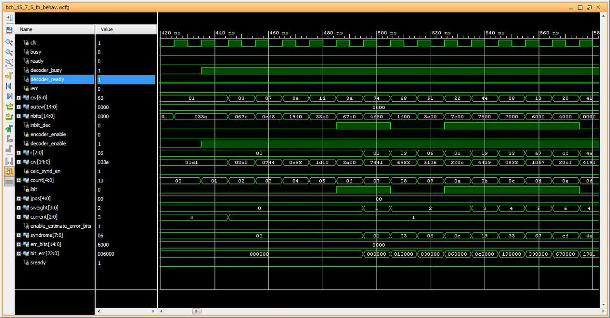
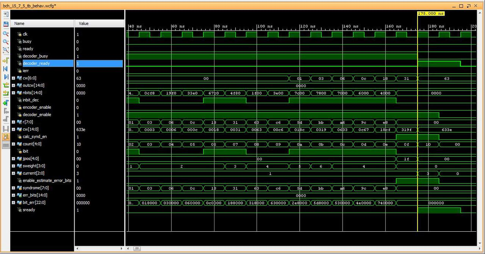

.. title: Implementing BCH (15,7,5) FEC
.. slug: bch15_7_5_hw
.. date: 2017-03-18 00:17:42 UTC
.. tags: hardware, latex
.. has_math: true
.. category: FPGA
.. link: 
.. description: 
.. type: text

This post is the implementation part of the my post on `Binary BCH (15,7,5) workout`_
where I did some math workout on the BCH forward-error-correcting code (FEC). I find
it to be simple enough to implement it in verilog that can eventually be synthesized for FPGA.
I choose the simplest algorithm for decoding the binary BCH (15,7,5) as outlined in my last post.

.. _Binary BCH (15,7,5) workout: http://souktha.github.io/misc/bch15_7_5
.. _link: `Binary BCH (15,7,5) workout`_ 

.. TEASER_END

Implementation
===============

The implementation can be targeted to any FPGA device. Since I am usinx Xilinx Vivado, I
am targeting it for Zynq or Artix type of device. For now, I am focusing on getting
the main algorithm to work correctly.  The implementation is less then 300 lines of 
code which I think it is fairly simple and straight forward. I implement it
as a serialized transceiver model. The simple specification of
the top module, *bch15_7_5_decode*,

*       Input (n bits): 

        . *dec_enable(1)*, enable decoder. This shall remain asserted while
        decoding is in progress. Host shall deassert this signal upon 
        detecting deassertion of *bsy*.

        . *ibit(1)*, serialized input bit (MSB first). Host shall wait
        for deassertion of *bsy* prior to placing data on *ibit* as data will
        be strobed on the rising clock.

*       Output (n bits)        

        . *bsy(1)*, decoder status. Assert by decoder while processing data. Host
        shall wait for *bsy* to go low before asserting *dec_enable*. If *dec_enable*
        is deasserted, *bys* is automatically deasserted. This signal is deasserted
        on completion of decoding.

        . *rdy(1)*, data ready. Assert on data ready upon decoding completion.

        . *err(1)*, error status. Assert on uncorrectable error.

        . *outw(7)*, 7bit decoded code word.

.. code-block:: verilog
   :linenos:

        module bch15_7_5_decode #(parameter IWIDTH=15, OWIDTH=7) (
            input clk,
            input dec_enable, //enable decoder
            input  ibit, //serialize input bit input code word
            output bsy, // state of decoder
            output rdy, // 1 when decoded data is ready for reading.
            output err, // error if undecodable
            output [OWIDTH-1:0] outw //7 bit output decoded word
        );
        ..

Decoder decodes 15 bits coded word input to 7 bits output with 2 bits error forward-error correcting
capability. For parallel input data bits, simply change *input ibit* to *input [IWIDTH-1:0] ibit*, and
change the inputting scheme of *module_gx*. The parallel data case saves half the number of bit shiftings.
This will make it roughly twice as fast.

Decoding algorithm
------------------

1 Calculate syndrome :math:`s(x) = w(x)\ mod\ g(x)` from the received codeword :math:`w(x)`.

2 For :math:`i \ge 0`, calculate :math:`s_i(x)=x^i s(x)\ mod\ g(x)` until :math:`s_j(x)` is found 
where weight of :math:`s_j(x) \le t`. 

3 Once :math:`s_j(x)` is located, :math:`e(x)=x^{n-j}s_j(x)\ mod\ (x^n + 1)` are the most likely
error bits.

The iteration for this one is at most :math:`2t` because
if there are :math:`\nu \le t` error positions, the iteration is :math:`\nu + t`.

The generator for this implementation is,

.. math::
        g(x) = x^8 + x^7 + x^6 + x^4 + 1

The decoder and FEC 
-------------------

The BCH FEC decoder takes in the serial 15-bit code word (MSB first), detects
if there is any error in the input codeword, and computes the most likely
bit(s) error position. The corrected codeword is returned as its
7-bit output word. 

The top module, *bch15_7_5_decode*, instantiates two submodules, *module_gx*
and *compute_error_cw*. 

.. code-block:: verilog
   :linenos:

           ..
           assign outw = cw[IWIDTH-1:`PBITS] ^ bit_correction[IWIDTH-1:`PBITS];
           ..
            modulo_gx syndrome (
                .clk(clk),
                .enable(divider_en),
                .ibit(ibit),
                .weight(sweight),
                .remainder(r)
                );

	    compute_error_cw likely_bits_err (
		.clk(clk),
		.enable(enable_estimate_error_bits),
		.syndrome(r),
                .weight(sweight),
		.pos(pos),
                .rdy(sready),
		.err_bits(bit_correction)
		);

The submodule, *modulo_gx* performs syndrome
computation continuously while input data is being shifted into its
divider circuit and it also output the computer code's weight from the
result. This is step 2 of the algorithm. If :math:`weight \le 2` and 
all the input bits are in, the circuit then enable the bits error 
computation circuit. This is step 3 of the algorithm. 

.. code-block:: verilog
   :linenos:

        ..
        assign weight = r[0] + r[1] + r[2] + r[3] + r[4] + r[5] + r[6] + r[7];

        /* divider g(x)=x^8 + x^7 + x^6 + x^4 + 1 * / 
        always@(posedge clk) begin
	        if (enable ) begin
		r[7] <=  r[6] ^ r[7];
		r[6] <=  r[5] ^ r[7];
		r[5] <=  r[4];
		r[4] <=  r[3] ^ r[7];
		r[3] <=  r[2];
		r[2] <=  r[1];
                r[1] <=  r[0];

		r[0] <=  ibit ^ r[7];
        end
        else 
                r <=  8'h0;
        end

step 3 of the algorithm performs final bit(s) error computation based on the result from
*modulo_gx* module. This module takes the syndrome, :math:`s_j(x)`, shift-multiplies
by :math:`x^{15-j}` then takes the modulo :math:`(1+x^{15})`. The resulted bit(s) error
needed for correction is *err_bits* where it is added to the input code word. The 
correction bits error includes both the information bits and the parity bits. The
final FEC code word is the upper 7 bits of the corrected code word.

.. code-block:: verilog
   :linenos:

        ..
	assign err_bits = bit_err[14:0]; /* error bits are lower 15 bits * /
        assign rdy = ready;

	always@(syndrome, pos, enable) begin
        if ( !ready ) begin
		bit_err = syndrome << (5'h0f  - pos);
		R  = bit_err[14:0];
        end
	end
        ..

	/* Divide by 1+x**15.
        Divide only if degree of the computed syndrome Si is >= 15.
       * /
	always@(posedge clk)
        if (enable) begin
		ready <= 1'b0;
        /* Divide if degree is >= 15 * /
		if ( bit_err[22:15] ) begin
			R[0] <= R[14] ^ ibit;
			R[1] <= R[0];
			R[2] <= R[1];
			R[3] <= R[2];
			R[4] <= R[3];
			R[5] <= R[4];
			R[6] <= R[5];
			R[7] <= R[6];
			R[8] <= R[7];
			R[9] <= R[8];
			R[10] <= R[9];
			R[11] <= R[10];
			R[12] <= R[11];
			R[13] <= R[12];
			R[14] <= R[13];
        
			ibit <= {ibit[6:0],1'b0};
                if (weight <= 4'h2 )
                        ready <= 1'b1;
		end
		else 
			ready <= 1'b1;
                end
                else
                ready <= 1'b0;

Some sample of waveforms captured  from the test bench based on this algorithm is shown for
various situation of bit(s) error. The simulation is for 100MHZ FPGA clock.

        Fig1: 15bit code word 0x033e with 2 bits error (expect 0x63)

.. figure:: ../../images/hardware/bch1575_033e_decoded.JPG

        Fig2: Coded word 0x033e with 2 bits error corrected. Output 7bit word is 0x63

        Fig3: Non-error codeword, decoded as-is (0x63).

.. figure:: ../../images/hardware/bch1575_1500_decoded.JPG

        Fig3: Non-correctable code word, code word 0x00 (0x1500) with 3 bits error. Decoded as error.

It takes only one clock to decode the non-error code word, immediately after the last input bit is shifted, and 
a maximum of four clocks for returning the corrected code word for the case where two or less error bits to
be corrected. It takes eight clocks to declare the non-correctable error.

Conclusion
----------

It appears that the algorithm works, at least as simulated. It is a proof of concept. If the math
is right, so will be the circuit since *math is everything and everything is math*. Timing analysis
and adjustment may be necessary on synthesis, but I will leave it for next time.

