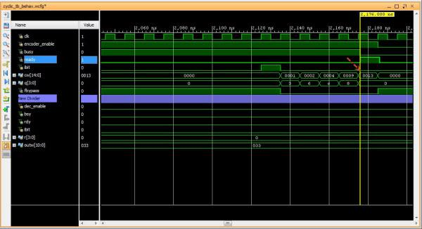

.. title: Simple Cyclic Hamming (15,11,3) FEC
.. slug: cyclic_1_x_x4_hw
.. date: 2016-12-22 00:17:42 UTC
.. tags: hardware, mathjax, latex
.. category: FPGA
.. link: 
.. description: 
.. type: text

This post is the implementation part of the my post on `simple cyclic Hamming code`_
where I did some math workout on this type of forward error-correction code (FEC). I am doing
it for fun since I think it is simple enough to implement it in FPGA. The generator
for this exercise is :math:`g(x)=1+x+x4` for an :math:`(n,k,d) \equiv (15,11,3)` code.

.. _simple cyclic Hamming code: http://souktha.github.io/misc/cyclic_1_x_x4
.. _link: `simple cyclic Hamming code`_ 

.. TEASER_END

Implementation
===============

If the data to be encoded is parallel data block, the encoded message can simply be done with
simple combinational logic based on the :math:`G` matrix, likewise for the decoder logic, but 
this is too boring. I choose to complicate this matter by assuming that the input data bits
to be encoded or decoded arrive serially, perhaps from a transceiver part of the circuit. This
way I can implement it with divider circuit and get myself frustrated with timing closure and 
everything else. Simple and elegant way is not always paid off. This is what I am going to do.

For this exercise, I am targeting the Xilinx Artix FPGA device. I create three verilog modules,

. Encoder for encoding 11-bit message to 15-bit message.

. Decoder for decoding the 15-bit receiving message. 

. Corrector is for correcting the error if syndrome indicates the error.

The encoder
-----------

The encoder takes a stream of 11-bit input message and encodes it to 15-bit messages in
systematic form. The input bit is clocked in bit-by-bit to the encoder whenever *enc_enable*
is asserted. On the completion of the encoding process, the *rdy* is asserted as an output
ready indicator so that the 15-bit encoded message can be read.

.. code-block:: verilog
   :linenos:

        /*(n,k,d) = (15,11,3) 
        input is serialized 11 bits, output is 15 bits*/
        
        module cyclic_1_x_x4_encode #(parameter IWIDTH=11, OWIDTH=15) (
            input clk,
            input enc_enable, //enable encoder
            output bsy, // state of encoder
            output rdy, // 1 when decoded data is ready for reading.
            input  ibit, //serialize input bit input code word
            output [OWIDTH-1:0] codeword
            );

            ..
            ..
            
            assign fbypass = (count <= `KBITS);

            always@(posedge clk ) begin
                if ( enc_enable ) begin
                    if ( count == 5'h0  ) begin
                        busy <= #1 1'b0;
                        ready <= #1 1'b0;
                    end
                    else begin
                        if ( fbypass  ) begin
			   /*pass through k bits of message*/
                            busy <= #1 1'b1;
                            ready <= #1 1'b0;
                            cw <= {cw[OWIDTH-2:0],ibit}; //left shift to MSB begin with 1st bit
                            end
                        else begin
                            cw <= {cw[OWIDTH-2:0],q[3]}; //concat parity bits to form coded word
                            if (count >= `NBITS) begin
                             busy <= #1 1'b0;
                             ready <= #1 1'b1;
                            end

                            end
                    end
                end
                else begin
                    cw <= 15'h0;
                    busy <= #1 1'b0;
                    ready <= #1 1'b0;
                    end
            end

            /*encoder for generator g(x) = 1 + x + x**4*/
            always@(posedge clk) begin
                if (enc_enable) begin
                    q[3] <=  q[2];
                    q[2] <=  q[1];
                    if ( fbypass )  begin
                        q[1] <=  q[3] ^ q[0] ^ ibit;
                        q[0] <=  ibit ^ q[3];
                    end 
                    else begin
                        q[1] <= q[0];
                        q[0] <= 1'b0;
                        end
                    if ( count == 5'h0 )
                        q <= 4'b0000;
                end
                else
                    q <= 4'b0000;

            end
        
        endmodule

Th encoder part of this module is between line 16-46. The divider circuit that forms the :math:`P_i` bits is between line 49-67.
The lines that forms the output coded word are at line 29 and 32. The sample simulation below shows one of the encoded message.
Any :math:`2^{11}` input message words can be encoded by this circuit and matches with the multiplication of the
:math:`G` matrix. This is how I know that the divider circuit works.

        Fig1: encoded message 01h

The decoder and FEC 
-------------------

The FEC decoder is the reverse of the encoder where it takes in the serial 15-bit code word, computes
the syndrome and if any 1-bit error is detected, the instantiated lookup bit correction will return
the correctable bit position. This completed the FEC process.

.. code-block:: verilog
   :linenos:

        module cyclic_1_x_x4_decode #(parameter IWIDTH=15, OWIDTH=11) (
            input clk,
            input dec_enable, //enable decoder
            input  ibit, //serialize input bit input code word

            output bsy, // state of decoder
            output rdy, // 1 when decoded data is ready for reading.
        	output err, // error if undecodable

            output [OWIDTH-1:0] outw //11 bit output decoded word
        );

        ..
        ..

	assign outw = cw[IWIDTH-1:`PBITS] ^ bit_correction[IWIDTH-1:`PBITS]; //bit 4 to 14 for this case

        always@(posedge clk ) begin
		if (dec_enable ) begin
			if ( count == 5'h0 ) begin
				busy <= #1 1'b0;
				ready <= #1 1'b0;
			end
			else begin
				if (count < `NBITS) begin
					/*This is to output data long enough to be read.*/
					busy <= #1 1'b1;
					ready <= #1 1'b0;
					end
				else begin
					busy <= #1 1'b0;
					ready <= #1 1'b1;
					end
                                quotient <= #1 {quotient[IWIDTH-2:0],r[3]}; //shift in MSB
			end
		end
		else begin
                    busy <= #1 1'b0;
                    ready <= #1 1'b0;
		end
            end

    /*dvivider for g(x) = 1 + x + x**4*/
    always@(posedge clk) begin
	if (dec_enable ) begin
                if ( count == 5'h0 ) begin
                    r <= 4'b0000;
                    ierr <= 1'b0;
		end
                else if ( count <= `NBITS ) begin
			r[3] <= r[2];
			r[2] <= r[1];
			r[1] <= r[3] ^ r[0];
			r[0] <= ibit ^ r[3];
                        cw <= {cw[IWIDTH-2:0],ibit};
                        if (r != 4'h0 ) begin
                                ierr <= 1'b1;
                        end
                end
		end
		else begin
	            r <= 4'h0;
                    ierr <= 1'b0;
                end
    end

    assign lookup_en = ierr;

    lookup11 correct(
        .en(lookup_en),
        .syndrome(r), //the remainder of division
        .errbits(bit_correction)
        );

    endmodule

The divider circuit (line 44-65) for the decoder is similar to that of the encoder, but it performs syndrome computation 
by taking all the input bits having the remainder shifted into the decoded output word. If the remainder is non-zero,
it set *ierr* bit as an enabler for *lookup11* module (line 67-73). The table lookup module returns the corresponding bit
error, *bit_correction*, where it does the modulo-2 sum to the decoded word (line 16). This is the FEC. 

The lookup module is a simple ROM type lookup table using the 4-bit syndrome as the index to the correction bit. It
returns non-zeros for *errbits* on any error, zeros otherwise. It covers both message bits and parity bits.

.. code-block::
   :linenos:

        module lookup11 #(parameter WIDTH=15) (
            input en,
            input [3:0] syndrome,
            output [WIDTH-1:0] errbits
            );
            reg [WIDTH-1:0] bitpos;
    
            assign errbits = bitpos;
    
            always@(*) begin
                if (!en) bitpos = 15'h0;
            else
            case (syndrome)
                4'h0: bitpos = 15'h0;
                4'h1: bitpos = 15'h1;
                4'h2: bitpos = 15'h2;
                4'h4: bitpos = 15'h4;
                4'h8: bitpos = 15'h8;
                4'h3: bitpos = 15'h10;
                4'h6: bitpos = 15'h20;
                4'hc: bitpos = 15'h40;
                4'hb: bitpos = 15'h80;
                4'h5: bitpos = 15'h100;
                4'ha: bitpos = 15'h200;
                4'h7: bitpos = 15'h400;
                4'he: bitpos = 15'h800;
                4'hf: bitpos = 15'h1000;
                4'hd: bitpos = 15'h2000;
                4'h9: bitpos = 15'h4000;
            endcase
            end
        endmodule

.. figure:: ../../images/hardware/decode_73d.jpg

        Fig1: decoded non-error message 0x73d for 0x73

I test the FEC logic with random test vector for several coded words out of :math:`2^{11}` possible coded words
and I can verify that any single bit error is corrected as it is a :math:`t=1` FEC. The code rate for this
implentation is :math:`\frac{k}{n} = \frac{11}{15}`

What is really needed for this FEC is only to correct the message error bit, any bit of the 11-bit. The *err* bit
can be used as a request for retransmission if the error bit falls into the parity area. This means that 
certain syndrome in the look up table will be partially used. Shortened code :math:`(12,8,3)` can also 
be obtained using this exact scheme with minimal change to the logic because it is more practical to
do it in 8-bit rather than 11-bit. 

.. figure:: ../../images/hardware/decoded_33d.jpg

        Fig1: FEC 1-bit error (bit 6) in coded word. Decoded and Corrected 0x33d for 0x73

Conclusion
----------

Cyclic code FEC of this type can be easily implemented with shift registers to perform modulo
division. The FEC in this exercise may not be efficient, but if it requires that the FEC be 
implemented with minimal gates then it would be practical.

When time permits, I will try to implement :math:`t > 1` FEC.
