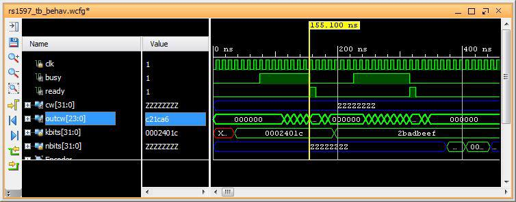
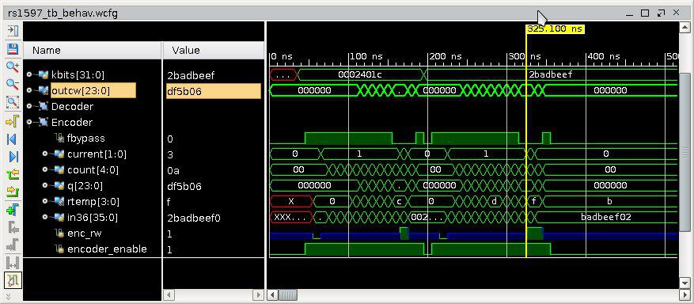
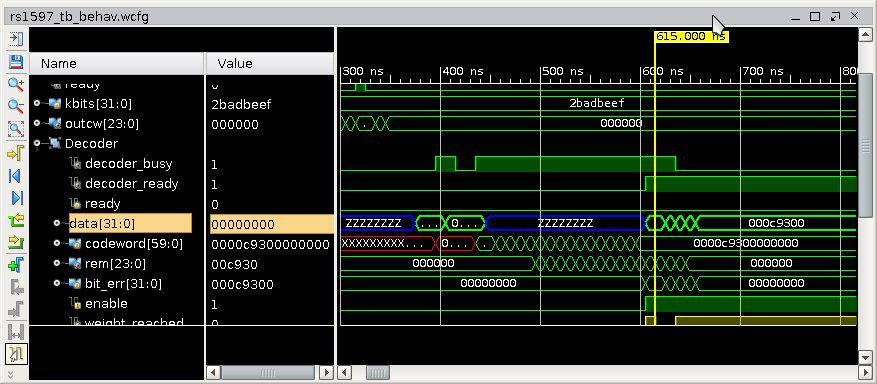

.. title: RS(n,k) code HDL implementation
.. slug: rs15_7_hw
.. date: 2017-05-06 14:47:03 UTC
.. tags: hardware, latex
.. has_math: true
.. category: FPGA
.. link: 
.. description: 
.. type: text

This post is the implementation part of the my post on `RS code workout`_
where I did some math workout on the RS forward-error-correcting code (FEC). I find
it to be simple enough to implement it in verilog that can eventually be synthesized for FPGA.
I choose the simplest algorithm to implement the RS (15,9,7) as outlined in my last post.

.. _RS code workout: http://souktha.github.io/misc/RS15_7_5
.. _link: `RS code workout`_ 

.. TEASER_END

Encoder
--------

For Verilog, all of these coefficient multiplications can be a modeled by the simple modules
that can be instantiated as the components of the RS encoder. The main part of this RS
encoder with :math:`g_7(x)` as its generator is listed below (minus the interface portion). 

*       32-bit data input to be encoded. 

        . *encoder_enable(1)*, enable encoder. This shall remain asserted while
        decoding is in progress.

*       24-bit output parity check        

        . *bsy(1)*, decoder status. Asserts while encoder is processing data. Host
        wait for *bsy* to go low before inputting the new data.

        . *rdy(1)*, data ready. Asserts on data ready upon encoding completion.

        . *outw(24)*, 24-bit output parity check bits.

Host can then append the returned parity check bits to its 32-bit input data
to form a complete coded word in systematic form. The actual data bit is
36-bit (9 symbols-bit), but shortened to 32-bit in this case.

.. code-block:: verilog
   :linenos:

    ..
    assign outw = q[23:0];
    assign rtemp = in36[35:32] ^ q[23:20];

    ..

    /* Encode by generator g(x) 
	Input is 9 symbols of 4 bit = 36 bits; however, the input to be encoded
	is 32 bit, so the four most significan bits are filled with zeros. This need
	to be taken into account (shortened).
	A symbol shift is a 4-bit shift.*/

    a_mult_alpha4 p4(.a(rtemp), .result(pa4));
    a_mult_alpha6 p6(.a(rtemp), .result(pa6));
    a_mult_alpha9 p9(.a(rtemp), .result(pa9));
    a_mult_alpha10 p10(.a(rtemp), .result(pa10));
    a_mult_alpha14 p14(.a(rtemp), .result(pa14));
    
    /* q contains the parity bits symbol*/

    always@(posedge clk) begin
        if ( encoding && !ready ) begin
				q[3:0] <= pa6;  //b0
				q[7:4] <= pa9 ^ q[3:0]; //b1
				q[11:8] <= pa6 ^ q[7:4] ; //b2
				q[15:12] <= pa4 ^ q[11:8]; //b3
				q[19:16] <= pa14 ^ q[15:12]; //b4
				q[23:20] <= pa10 ^ q[19:16]; //b5
        end
        else begin
			 if ( !ready )
				q <= 24'h0;
			end
    end
        
        ...

        module a_mult_alpha9 (
            input [3:0] a,
            output [3:0] result
            );
            assign result[0] = a[3] ^ a[1];
            assign result[1] = a[3] ^ a[2] ^ a[1] ^ a[0];
            assign result[2] = a[3] ^ a[2] ^ a[1];
            assign result[3] = a[3] ^ a[2] ^ a[0];
        endmodule
        ..

        
* Line 3 takes the shifted symbol input, modulo-sum with the output of *b5*.
  Its output, *rtemp* is then fed to the divider circuit.

* Line 13-34 performs continuous multiplication of :math:`\alpha^i` with *rtemp*
  and modulo-sum to each stage of the registers where they are connected as depicted in
  my workout post for this code.
  *outcw* contains the parity check bits where it can be concatenated to the input
  word to form a complete coded word.

* An interface signal, *rdy* is then asserted on completion of encoding for
  each input word (interface circuit modeling not shown here).

* Line 38-46 is the sample of one of the modules that compute
  :math:`\beta \alpha^9`.

The external interface part of this behavorial modeling is 
subjected to the implementation. The focus here is on algorithm to prove
that it is mathematically correct and in agreement with the implementation.

        Fig1: The 24-bit parity check (c21ca6)  for the encoded input word (2401c). 

        

        Fig1: The 24-bit parity check (df5b06)  for the encoded input word (2badbeef). 

Decoder and Error-Correction
-----------------------------

The decoder takes in two 32-bit data, one is the message and one is the parity check data. The
parity check data is 24-bit data (6 symbols of 4-tuple). In this implementation, the
data will enter the decoder as h0002_401c and hC21C_A600. 

To be able to correct any error is to first detect if there is any error. The error detection
process is simply determined right after the input symbols(15) have been shifted into the decoder.
The decoder is the same block as used for encoding with minor interface adjustment. Basically it
is the same module :math:`g_7(x)` as worked out in my other post. Simple interface,

*       32-bit data input to be encoded. 
        
        . *rw(1)*,  host writes one 32-bit data at a time for data and parity. Host writes
        sequence of two 32-bit data on deassertion of *bsy*. Host read data when
        *rdy* is asserted. If undecodable code,  *err* is asserted.

        . *bsy(1)* asserts while decoding in in progress and deasserts on completion. 
        
        . *rdy(1)* asserts when data is ready.

        . *decoder_enable(1)*, enable decoder. This shall remain asserted while
        decoding is in progress.

        . *data(31)* input/output data.

*       32-bit data output.

        . *date(32)* input/output data. Output data from decoder when *bsy* is deasserted and *rdy* is asserted.

        . *rw(1)* read data when *rdy* is asserted.

Here is some example of its error correction,        
        
.. figure:: ../../images/hardware/rs_decoded_0ac2_421c.jpeg

        Fig1: Corrected 3 symbols(12-bit) of input coded word h0AC2_421C to h2_401C. 

It can also correct burst error,

        Fig1: Corrected zero code word with burst error of length 12. 

Summary
--------

The encoding/decoding that I implement is relatively simple, may be 200-300 lines of verilog
code with the majority of it is for host interface. The algorighm itself is small for this
exercise. So far it can correct error any where whether the error is in message portion 
or in parity check portion. While my implementation may not be perfect, I think it is as 
simple as I can make.
