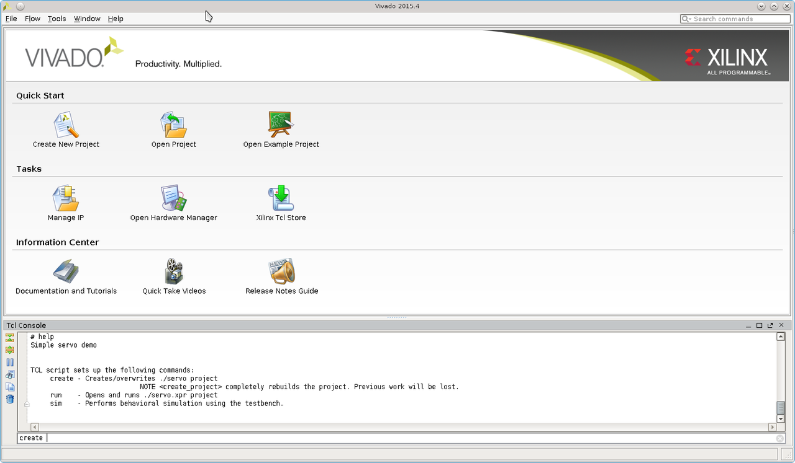
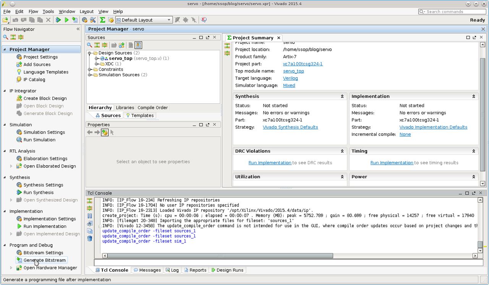
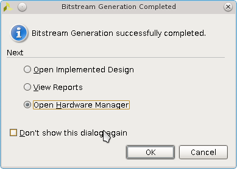
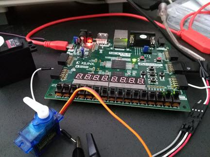
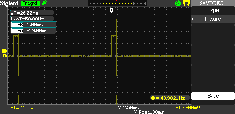

.. title: servo driver
.. slug: servo
.. date: 2016-03-12 05:25:40 UTC
.. tags: hardware
.. category: 
.. link: 
.. description: driving servo with FPGA
.. type: text

Servo
=====

Servo motor is an electromechanical drive that is relatively simple to operate. A
typically servo motor has relatively few movements, namely left, right and center.
Controlling its movement is to send the periodic pulse width of about 1.5ms, 1ms or 2ms for
the center, left, and the right movement respectively. 
In this demo, I use a very simple verilog code to control its movement.

.. TEASER_END

Tool use
-----------
- Xilinx Vivado 2015.4
- Siglent 100MHZ DSO (optional)  

Hardware component
------------------
- Digilent Nexys4DDR
- Servo motor (SG90, or HS-311).
- External 5V power supply needed for the servo.  
- Wires and cables for connections.

Interface 
--------------------------
- sw[1:0] are for position control
- led[1:0] are connected to sw[1:0]
- ja[0] for motor drive  

H/W Synthesis
-------------

- cd to my loca directory where the verilog source files reside (Code available in my respoitory  https://github.com/souktha/servo)
- start vivado, 

..  .. image:: ../../images/servo/tcltool.png 

- select Tools -> Run Tcl Script... 
- Click  setup-servo.tcl to run the setup.
- 'create' at tcl shell command window. Vivado will create the project for this demo.

- On Vivado, generate bitstream 

        
        instead of step-by-step go straight to generate bitstream

.. only figure has caption, not image !

- Once completed (do not expect error), with the board connected, open the hardware manager and download the bitstream to the Nexys4DDR.
  Board will be up and running with the synthesized FPGA code.

        bitstream generation complete

The set-up
-----------

Output waveform
---------------

For this servo motor, it is powered externally by a 5V power supply; however, the driving pulse is directly from ja[0] pin of the FPGA.
Using sw[1:0] I can control its movement.

        Example of the periodic control signal

Conclusion
----------

Servo motor of this type is very easy to operate and it can tolerate a small variation of the periodic frequency. Having the right
duty cycles for the controlling signal is more important. In this experiment I use 50HZ periodic frequency to keep the coil
energized as required by its specfication. The HITec HS-311 works the same way as this SG90 servo.
Stepper motor will require more complicated controlling phases. This will be my next post.

Citations
---------

.. [ref] SG90Servo.pdf - Servo motor spec
