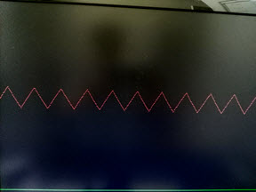
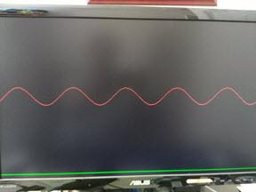

.. title: Displaying Xilinx XADC on VGA
.. slug: vga-display-xadc
.. date: 2016-04-03 21:10:14 UTC
.. tags: hardware
.. category: 
.. link: 
.. description: 
.. type: text

My previous blog was about displaying simple bar graph on a standard VGA 640x480@60HZ monitor using synthesized Verilog code.
This blog is to follow on with that exercise, but using the actual sampled data from the Xilinx XADC instead.

.. TEASER_END

The Artix7 FPGA on Digilent Nexys4DDR has a dual 12-bit 1 MPBS Analog-to-Digital converter in it which I think is
pretty good enough for the wide variety of applications. According to its user guide [1]_, this integrated component
is available in several Xilinx FPGA products. My understanding about its functionality would eventually be 
applicable to other Xilinx's FPGAs such as the Kintex, Zynq-7000 etc.. Later on I will use it with the Zynq-7000 series
with the integrated ARM Cortex.

This XADC can access up to 16 auxiliary analog input channels. This is stated in page 17 of its user guide [1]_.
For my exercise I will use only one bipolar pair of *Vp/Vn* input channels of this device. The nominal input range 
to this ADC channel will be in accordance to its specification which is 0-1V. 

Tools and equipment use
=======================

- Xilinx Vivado 2015.4 
- Digilent Nexys4DDR  
- Arbitrary waveform generator
- VGA monitor
- Cables

Implementation
==============

Unfortunately I will have to make use of the Xilinx IP core for the XADC. Generate and instantiate it then feed its output
to the VGA display monitor. I do not know its core well enough to do it with pure Verilog code. Even if I do it may 
not worth the effort. 

The interfaces
---------------

- In this implementation, the XADC is to be operated in *Single Channel mode* on channel 19 (*VAUXP[3], VAUXN[3]*). 
  Its timing mode is *continuous mode* and its conversion rate is set to 500 KSPS. It is instantiated from the generated core IP.

.. code-block::

    xadc_wiz_0 XADC_INST(
        .daddr_in(8'd19), //19 for vaux3
        .dclk_in(CLK100MHZ),  //4*time FS. This is set in the IP wizard.
        .den_in(dp_we),  //connect this to eoc_out for continuous sampling.
        .di_in(),  //not use
        .dwe_in(),  //not use
        .reset_in(),
        .vauxp3(vauxp3), 
        .vauxn3(vauxn3), 
        .busy_out(xadc_bsy), 
        .channel_out(chout), 
        .do_out(xadc_dout), 
        .drdy_out(xadc_drdy), 
        .eoc_out(dp_we), 
        .eos_out(xadc_eos), 
        .alarm_out(xdc_alarm), 
        .vp_in(), 
        .vn_in()
        );

- The two bipolar inputs are from PMOD JXADC pin 1 (*AD3P*) and pin 7 (*AD3N*). The two inputs are connected to waveform generator during the test. 
- The output of XADC is stored in DPRAM location on XADC's EOC signal by its *DRDY_OUT*. Its *EOC_OUT* is connected to *DEN_IN* for continuous sampling.

.. code-block::

    ram_dual_port #(
        .DATA_WIDTH(16), 
        .ADDR_WIDTH(10))
     dp_ram(
        .clk(CLK100MHZ),
        .we(xadc_drdy & SW[0]), //write on every DRDY as enabled by SW[0]
        .data(xadc_dout), //data from xadc to be stored
        .read_addr(x), //location to be read for VGA x-coordinate
        .write_addr(xadc_waddr), //location to store on EOC
        .q(dp_rdata) //Y data read correspond to x-coordinate
        );

- SW[0] is use as sampling on/off switch. If SW[0]=1, sampled data is continously stored and displayed otherwise it displayed the previous sampled data. 
  Basically I use it to take a snapshot of the sampled data.
- The LED displays are not very useful other than to display the activity.
- VGA plot the sampled point corresponded to the stored sampled data, *xadc_data* which is scaled value of the actual 12-bit data. 

Code that generates VGA display signal and the related DPRAM access was described in my previous post. In this exercise, I
only bring in those modules fnd instantiate them for this exercise.

Test
=====

I use the output of the waveform generator to connect to the XADC channel 19 input. I take the snapshot photos of the
sampled for the sine waveform and the ramp waveform as they are displayed on the VGA monitor below.

        Image of the sampled 10KHZ ramp waveform, 1VPP
 

        Image of the sampled 4KHZ sine waveform, 1VPP 

The images above are the snapshots of the sampled waveforms resulting from the toggling of *SW[0]* that start/stop data storing process. The 
sampling process is continuous, only the storing process is controlled by *SW[0]*.

Not much information from the LED displays since the data rate is much too fast to capture and the forever changing
data output to the LED display make them stay lit.

Conclusion
===========

It looks like the XADC is working for me. It took me a while to figure out and tuning the parameter especially when plotting
in on the screen. My sample code is in https://github.com/souktha/vga_display_xadc. Source code includes a tcl script. By
running the setup script it will create the workspace and run everything to generate the FPGA bitstream.

Citations
==========

.. [1] 7 Series FPGAs and Zynq-7000 All Programmable SoC XADC Dual 12-bit 1 MSPS Analog-to-Digital Converter User guide,
        UG480(v1.7), May 2015, Xilinx.
