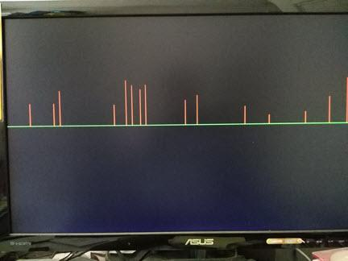

.. title: Drawing bargraph on VGA with Nexys4DDR
.. slug: vga_draw_graph
.. date: 2016-03-19 19:52:20 UTC
.. tags: hardware
.. category: FPGA
.. link: 
.. description: 
.. type: text

.. $Author: ssop $
.. $LastChangeDate$
.. $Rev$

The Digilent Nexys4DDR has only one video port which is a VGA port. With a small set of verilog code, I can synthesize a simple circuit to
draw some bar graph having each line with a width of one pixel. To achieve this I need to create the HSYNC and VSYNC for the
desired output of 640x480@60HZ.
The standard VGA of 640x480 is meant for its displayable area while it actually has 800x525 of total area. This makes the 
required pixel clock frequency of 800 * 60 * 525 = 25.200MHZ.

.. TEASER_END

For this, I divide the on-board 100MHZ by 4 which should be good enough since VGA monitor is not very sensitive to this small variation. It 
can lock to the sync signals quite easily. There are some website to visit with wealth of information such as fpga4fun.com[1_]

Implementation
==============

Divide 100 MHZ  down to 25MHZ as pixel tick and have two counters to keep track of horizontal and vertical pixel counts. The counters will
then be compared to horizontal retrace value and vertical retrace value. The horizontal end value and the vertical end value would be,

.. code-block:: verilog

        assign h_end = (hcnt >= (HD + HF + HB + HR - 1 )); 
        assign v_end = (vcnt >= (VD + VF + VB + VR)); 

where HD = 640 (displayable Horizontal), HB = 48 (Horiz back porch), HF = 16 (Horz front porch), HR = 96 (Horz retrace). These are all in 
pixels. Because the pixel counter is clocked by the pixel clock, p_tick, their values also represent time. The similar description goes
for VD, VF etc.. but for the vertical pixels count. This is all for vga_sync.v source.

As a test file, I create a small lookup table, called room_lookup where I can instantiate and feed the data to the VGA component. When the
board is programmed with the bitmask, these will be the data to display. The 10-bit rom_addr is needed to cover 800 pixels although the
area beyond 640 will not be used. This is rom_lookup.v content.

Next comes the top module that instanstiates these simple modules to draw the graph from top of the screen down until it hits the center
of the screen. Where it places each pixel is determined by rom_data.

.. code-block:: verilog

            always@(posedge p_tick)
		if (video_on ) begin
            if ( (y >= 10'd239-data) && (y < 10'd239) )
                rgb <= 12'hf00;
            else 
                if ( y == 10'd239 ) //middle screen horizontal line (x,239)
                    rgb <= 12'h0f0;
                else
                    rgb <= 12'h0; //nothing pass horizontal line
		end else 
			rgb <= 12'h0;

Tools used
==========

1) Xilinx Vivado 2015.4 Webpack
2) Digilent Nexys4DDR
3) VGA monitor and cable.

Synthesize the circuit
----------------------

1) Get the code in https://github.com/souktha/vga_draw_graph
2) Start Vivado --> Tools -->  Run Tcl script..
3) click setup-vga-draw.tcl to create work space
4) Synthesize and generate Bitstream
5) Open Hardware Manager --> Open targe --> Program device.
6) Choose the board and download Bitstream.

        Simple drawing on 640x480@60HZ

        
To do
-----

Perhaps I will create some character bitmaps to display if I have time to spend. This will be very educational
to me as well as I make more progress.

Citations
---------

.. [1] www.fpga4fun.com - has lot of informations about various IOs and tutorials.
.. [2] www.digilent.com - FPGA boards vendor with many useful articles.
.. [3] www.xilinx.com - FPGA chip vendor.

