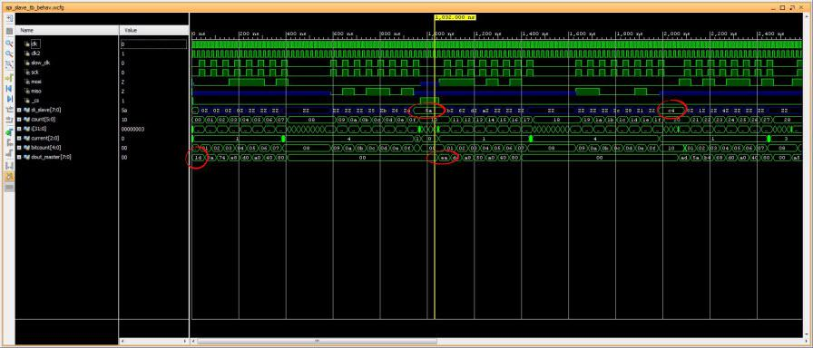
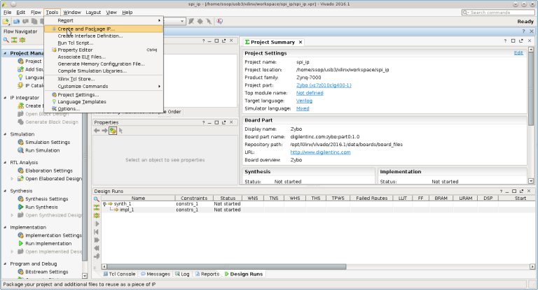
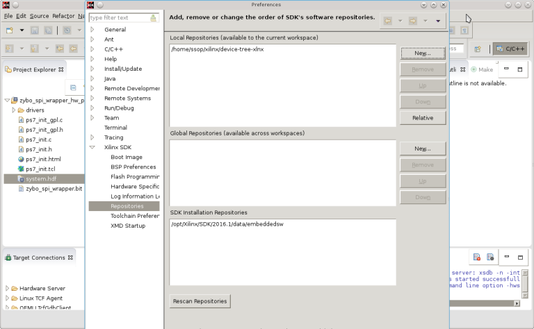

.. title: Zynq Zybo SPI slave via EMIO
.. slug: zybo-spi-slave
.. date: 2016-07-17 18:10:54 UTC
.. tags: hardware, software
.. category: 
.. link: 
.. description: Adding custom SPI slave device connected to SPI0 via EMIO
.. type: text

I would like to add a simple IO peripheral device to the Zynq Zybo board and I would like to learn how much
effort I need to get PS-PL interconnected and can be used by high level OS such as Linux.
For this exercise, I choose to create a simplest device for the Zynq PL that interface with its PS. My choice
is to create a SPI slave device (PL) that will interconnect to the SPY master of the Zynq (PS).

.. TEASER_END

Although there are a lot of MIO pins available on Zynq7000, but they are almost always used up. For Zybo board they
are mostly used for various peripheral devices such as Ethernet, USB, SD, UART, CAN etc. If more IO is needed, the
EMIO is available for MIO-EMIO routing (Chapter 2,17 of [2_]). Here is the simple specification of the SPI slave
device for this exercise.

SPI Slave device
----------------

. Four wires: MOSI (input from master), MISO (output to master), _CS (chip select from master), CLK (clock from master). 

. Phase and Polarity fixed to mode 0.

. Support back-to-back transfer.

. Use MIO/EMIO routing interface of the zynq7000.

. 8-bits command/data.

. Basic command support: Read ID (0x1d), Read(0xea), Write(0xad). Limited to three commands for simplicity. Any other
commands is rejected.

Here is the sample of verilog code of my SPI slave device, *spi_slave.v*,

.. code-block:: verilog

        `timescale 1ns / 100ps

        `define DEVICE_ID 8'h5a

        /* SPI slave interface.
        This is a simple version of SPI slave mode 0. 
        * /

        module spi_slave #(parameter WIDTH=8) (
            input clk,  //system clock feed
            input _cs,  // chip select, active low
            input sck,  //spi master clock 
            input mosi, //input from master
            output miso
        );
            reg [WIDTH-1:0] din, dout,slave_dout;
            reg [4:0] bitcount;
            reg sout, dload;
            reg [7:0] command;

            reg [2:0] current,next;
            /* possible states: IDLE, CMD_IN, CMD_PROCESS for command received,
            DIN for data from master, DOUT for data to master.
            Commands are: READ_ID=0x1d, READ=0xea, WRITE=0xad.
        	ID data  * / 
            parameter IDLE=0, CMD_IN=1, CMD_PROCESS=2, DIN=3, DOUT=4, INVALID=5, CMD_DEBUG=6;
            parameter READ_ID=8'h1d, READ=8'hea, WRITE=8'had;

	    initial begin 
		current = IDLE; 
		next = IDLE;
		command = 8'h0;
		bitcount = 8'h0;
		dload = 1'b0;
	     end

          /* _cs is to remain asserted during command and data transfer.*/

            always@(posedge clk, negedge _cs) 
             if ( !_cs ) begin
		 if (current == IDLE )
			current <= CMD_IN;	/* on assertion of _cs*/
		 else 
			 current <= next;
        	 end else current <= IDLE;

	   /* state machine transition*/

            always@(current or bitcount or _cs)
		if (_cs ) next = IDLE;
		else
            case(current) //full_case
            CMD_IN: begin
                if ( bitcount[3]) begin
                    #1 command = din; //latch in command
				next = CMD_PROCESS;
			  end 
			else begin 
                          next = CMD_IN;
                          end
			end
	    CMD_PROCESS: begin
			case (command)
				READ_ID: begin
					slave_dout = `DEVICE_ID; //ID is 5A or as defined
					next = DOUT; // transition to DOUT via miso
					dload = 1'b1;
					end
				READ: begin
					slave_dout = 8'hc4; //use this for dummy read for now 
					next = DOUT;
					dload = 1'b1;
					end
				WRITE: begin
					next = DIN;
					end
				default: begin 
                                        next = CMD_IN; //reject invalid cmd
                                        end
				endcase
			end
	     DIN: begin
		if ( bitcount[4]  ) begin
			next = CMD_IN;
                   end
			else 
				next = DIN;
			end
	    DOUT: begin
		if ( bitcount[4] ) begin
			next = CMD_IN;
                end
		else 
	        	next = DOUT;
			dload = 1'b0;
		end
        endcase

    /* MISO at z if not in DOUT phase. Don't drive it.*/
    assign #1 miso = sout;

    always@(posedge sck, posedge _cs, posedge current )
      if (_cs || current != DOUT) 
       sout <= 1'bz; 
      else
       sout <= dout[7];

    /* sample MOSI bits 
    >--01234567---->---01234567----->
     |--------------------------|   * /
    always@(posedge sck, posedge _cs ) begin
		if (_cs ) #1 bitcount <= 8'h0;
        else  begin
    		#1 din <= {din[6:0],mosi};
   	    	#1 bitcount <= bitcount + 1'b1; 
            if (bitcount[4]) #1 bitcount <= 4'h1;
         end 
    end
            
    /* Transmit MSB first * / 
    always@(posedge sck, posedge dload)
		if (dload) 
		 dout <= slave_dout;
		else
		 dout <= {dout[6:0],mosi}; //loop with input data
    
        endmodule

That is all for this simple SPI slave device. It is then simulated with *spi_slave_tb.v*, and from what
I can tell it should work and that the code is synthesizable. It is now ready for integration to the PL
part of the Zynq7000.

Software tools
--------------
The sofware tools and software packages I use for this exercise are:

. Vivado 2016.1 webpack.

. Cross GNU toolchain to compile the Linux kernel and SPI slave driver later.

. Xilinx Linux kernel, device tree plugin (for Xilinx SDK).

Simulate SPI slave device
-------------------------

Using Vivado, I create the project for the simulation of the SPI slave device shown above. This simple
project needs only two files, *spi_slave.v* which is the main SPI slave device source and *spi_slave_tb.v*,
its testbench.

        Waveform of the simulated SPI slave device.

Looks like it will work, so my next step is to create the custom IP package for it.

Create and package IP
---------------------

Start vivado and do these steps to create the custom IP that will be integrated into the design later,

. Quick Start -> Create new project -> next

. Fill in the Project name and project location. Project name set to *spi_ip* and project location set to my local workspace -> next.

. Project type leave it as RTL project -> next.

. Add existing IP -> next since no existing IP to be added in this page.

. Add constraints -> next since no constraint to be added in this page.

. Default part -> Boards -> Zybo ->next (select Zybo).

. New Project Summary -> Finish.

. Tools -> Create and package IP -> next -> Create a new AXI4 peripheral.

. Peripheral Detail -> name set to *myspi_ip* -> next. 

. Add interface -> next

. Create Peripheral -> Edit IP -> Finish.

.. figure:: ../../images/hardware/slave_ip_edit_ip.png

After *edit_myspi_ip_v1_0* pops up, add *spi_slave.v* and modify the AXI template as necessary,

.. figure:: ../../images/hardware/slave_ip_add_sources.png

. Under Design Sources, right click on *myspi_ip_v1_0* and select add sources to add *spi_slave.v*.

. Double clicks on *myspi_ip_v1_0.v* to open for editing.

. Add the following code,

.. code-block:: verilog

      	// Users to add ports here
        input wire spi_cs,
        input wire spi_mosi, //it is input with respect to this slave
        input wire spi_sck,
        output wire spi_miso,
      	// User ports ends

. Save and close *myspi_ip_v1_0.v* file.

. Double clicks to open *myspi_ip_v1_0_S00_AXI.v* for editing. Add the following code to instantiate the 
custom SPI slave IP,

.. code-block:: verilog

	// Users to add ports here
        input wire _cs,
        input wire mosi,
        input wire sck,
        output wire miso,
	// User ports ends

	..
	//instantiate spi_slave here at the end of the file.
      	// Add user logic here
    spi_slave myspi(
    ._cs(_cs),
    .miso(miso),
    .mosi(mosi),
    .sck(sck),
    .clk(S_AXI_ACLK));
	// User logic ends

. Save and close the source file, *myspi_ip_v1_0_S00_AXI.v*.

. File Groups -> Merge change Groups Wizards to merge all the changes made.

. Review and Package -> Re-package IP.

. Finised packaging. Do you want to close the project -> yes.

. Close *spi_ip* project.

This completed packaging the SPI slave IP for this demo. The IP is packaged and stored in the 
*ip_repo* in my local workspace (default).

Create Zynq design block with the custom SPI slave IP
-----------------------------------------------------

Having custom IP ready, now it can be integrated into the Zynq Zybo system. Starting a new project,

. Quick Start -> Create a New Vivado Project -> next.

. Project name set to *zybo_spi* and project location set to local workspace then -> next.

. Project Type set to RTL project -> next.

. Add sources -> next (no source to add).

. Add existing IP -> next.

. Add constraints -> next.

. Default part -> Boards -> *zybo* -> next.

. New Project Sumamry -> Finish.

Create zynq block design,

. Flow Navigator -> IP Integrator -> Create Block Design.

. Design Name set to *zybo_spi* -> Ok.

. Diagram -> Add IP to add Zynq.

. Double click Zynq7 processing syatem to add ZYnq block. This is the PS. PL (IP) is to added next.

. Project Manager -> Project Settings -> IP -> Repository Manager. Click (+) to add IP repository where *spi_ip* is packaged. Click Ok when done.

. Diagram -> Add IP. Type *myspi* in search box of IP list and select *myspi_ip_v1_0* to add.

.. figure:: ../../images/hardware/zybo_spi_add_iprepos.png

. Diagram -> Run block automation and Run Connection automation for Zynq and SPI slave IP -> Ok.

. Edit Zynq7 PS from default design before making the  connections,

.. figure:: ../../images/hardware/zybo_spi_recustomize.png

. Double click on Zynq7 PS in the block diagram to open its setting (Zybo default).

. Recustomize IP -> MIO Configurations -> SPI0 click to enable and leave it at EMIO interface -> OK.

. Now SPI0 appears in Zynq7 block. Expand it to make connection to SPI slave IP.

. Make connections between Zynq7 to *myspi_ip_0* block: SPI0_MOSI_O->spi_mosi, SPI0_MISO_I->spi_miso,
SPI0_SCLK_O->spi_sck, SPI0_SS_O->spi_cs. 

.. figure:: ../../images/hardware/zybo_spi_makeconnections.png

. Diagram -> Validate Design.

. Design sources -> Zybo_spi.bd -> Create HDL Wrapper, Let Vivado manage wrapper and auto-update -> OK.

. IP Integrator -> Generate Block Design -> Generate.

. Flow Navigator -> Run  Synthesis.

. Run Implementation.

. Generate bitstream.

. Skip Open Implemeted Design. Click Cancel.

. File -> Export -> Export Hardware (include bitstream ).

. File -> Launch SDK -> OK.

The bitstream generated for this design is *zybo_spi_wrapper.bit*. This will be used later.

Generating device tree
-----------------------

Next step is to generate device tree for the BSP of this design. On Xilinx SDK,

. Xilinx Tool -> Repositories, add *device-tree-xlnx* for local workspace.

. File -> New -> Board Support Package. *Board Support Package OS* set to *device_tree* -> Finish.

. View the generated file in *device_tree_bsp_0*. Files of interest are *zynq-7000.dtsi* and *system.dts*. 

. File -> Exit to close SDK.

Device tree files are store in my workspace/zybo_spi/zybo_spi.sdk/device_tree_bsp_0 directory. The
*device-tree-xlnx* is pulled from Xilinx github (https://github.com/Xilinx/device-tree-xlnx).

Port device tree to Linux kernel
----------------------------------

There are two files that need to be replaced or modified, *zynq-7000.dtsi* and *zynq-zybo.dts*. Both of
these are located in *linux-xlnx/arch/arm/boot/dts* directory which is Xilinx's kernel git version. I replace
the original *zynq-7000.dtsi* with the one generated from my design and add portion of code in *system.dts* into
the existing *zynq-zybo.dts* as follows,

.. code-block::

        //add this custom spi0 block for my custom driver, spi5a
        &spi0 {
	        is-decoded-cs = <0>;
        	num-cs = <3>;
	        status = "okay";

        	spi5a@0 {
		compatible = "souk,spi5a";
		reg = <0>;
		spi-max-frequency = <1000000>;
	      };

        };//end of zynq-zybo.dts

Since my Zybo's kernel(zImage) has already been compiled, I only need to recompile the device tree. 

.. code-block::

        make ARCH=arm CROSS_COMPILE=arm-linux- zynq-zybo.dtb

follow by appending the device tree blob to zImage for booting. This is creating the U-Boot FIT image,

.. code-block::

        mkimage -f kernel.its zImage.itb

The *kernel.its* is the FIT image description source file. This file is created and placed in 
*linux-xlnx/arch/arm/boot/* directory. I 'cd' to this directory to create the FIT image. This is
the content of *kernel.its*,

.. code-block::

        /dts-v1/;

       / {
        	description = "ARM Zynq Zybo FIT (Flattened Image Tree)";
        	#address-cells = <1>;

        	images {
        		kernel@1 {
        			description = "ARM Xilinx Zynq Linux-4.x";
        			data = /incbin/("zImage");
        			type = "kernel";
        			arch = "arm";
        			os = "linux";
        			compression = "none";
        			load = <0x800000>;
        			entry = <0x800000>;
        			hash@1 {
	        			algo = "crc32";
        			};
        			hash@2 {
	        			algo = "sha1";
        			};
		        };

	        	fdt@1 {
		        	description = "ARM Zynq Zybo device tree blob";
			        data = /incbin/("dts/zynq-zybo.dtb");
        			type = "flat_dt";
        			arch = "arm";
        			compression = "none";
			
        			hash@1 {
        				algo = "crc32";
        			};
        			hash@2 {
        				algo = "sha1";
        			};
        		};

	        };

        	configurations {
	        	default = "config@1";

        		config@1 {
	        		description = "Zynq Zybo";
		        	kernel = "kernel@1";
			        fdt = "fdt@1";
        		};

	                };
        };

        
Custom Linux SPI slave device driver
------------------------------------

The final step is to create the Linux SPI slave device driver. This should be very simple to create since
it is for the do-nothing device. It is the driver that only exercises/validates the SPI protocol. As shown in
the verilog code, this device only accepts three commands: READ_ID(*0x1d*) where it will return the value of 
*0x5a* as its ID. READ(*0xea) where it will return value *0xc4*, and WRITE(*0xad*). WRITE command will not
return anything. It is meant for this SPI slave device to act upon it. For this design it does not do anything
with data written from host (master SPI). 
Here is major the code for SPI slave device driver, *spi5a.c*, which is very simple. All it does is reading ID 
and reading a fixed data from the SPI slave on loading. It is to prove that if the data return from 
these operations, then the SPI slave device works.

.. code-block:: c
        :linenos:

        ...

        static int spi5a_probe(struct spi_device * spi)
        {
        	int ret=0;
        
        	spi->bits_per_word = 8;
            	spi_setup(spi);

        	printk(KERN_INFO "spi read ID for cs %d, mode %d, bpw %d\n",spi->chip_select,spi->mode,spi->bits_per_word);
        	ret = spi_w8r8(spi, 0x1d); //read ID

        	if (ret < 0) {
        		dev_err(&spi->dev, "not found.\n");
        		printk(KERN_INFO "spi read id return 0x%x\n",ret);
        		return ret;
        	}
        	printk(KERN_INFO "%s returns id= 0x%x\n",__FUNCTION__,(u8)ret);

        	ret = spi_w8r8(spi, 0xea); //read 
        	printk(KERN_INFO "%s read(ea) returns 0x%x\n",__FUNCTION__,(u8)ret);

        	return 0;
        }

        static int spi5a_remove(struct spi_device * spi)
        {
        	return 0;
        }

        static struct spi_driver spi5a_driver = {
        	.driver = {
	        	.name	= "spi5a",
        	},
        	.probe	= spi5a_probe,
        	.remove = spi5a_remove,
        };
        ...
        
Line 7,8 setup kernel SPI device interface. Line 11,20 read SPI slave device and display the result. Next is 
to compile the device into kernel module to obtain *spi5a.ko*.

Test the SPI slave device
----------------------------------

Next is to test the custom SPI device. For this, Zybo has to boot up to login prompt and bitstream has to be loaded 
follows by loading the driver.

. Boot up and login to Zybo. The kernel image is the version built with the generated device tree of this design having 
SPI0 enable for use. The Xilinx default version from git will not work for this design. This is the whole idea of
everything that was done in prior steps. 

. Load *zybo_spi_wrapper.bit*, load the Linux *spi5a* custom driver and observe the result. These two files are
stored in my local root directory of rootfs.

.. code-block:: console
        :linenos:

        # cat zybo_spi_slave_wrapper.bit > /dev/xdevcfg 
        # insmod ./spi5a.ko 
        spi read ID for cs 0, mode 0, bpw 8
        spi5a_probe returns id= 0x5a
        spi5a_probe read(ea) returns 0xc4

Line 1 is to load the generated FPGA bitstream (PL) of this simple hardware. Line 2 is to load the linux kernel module 
which is the SPI slave device driver. Line 3 is the debugging message to confirm the SPI device that the driver is
communicated with. 

I get the result I expected (line 4,5) , reading device ID returns 0x5a, and read return 0xc4. This is consistent to
what being set in the synthesized Verilog code, *spi_slave.v*

Packaging bitstream to the system
---------------------------------

Since I am using U-Boot and Linux OS for my Zybo board, I can automate the process of loading the bitstream at U-Boot
stage by U-Boot script and U-Boot command. U-Boot for this board supports FPGA bitmask loading, using U-Boot's 
*fpga loadb 0 $loadaddr $filesize* (line 18) will load this bitstream as demonstate below,

.. code-block:: console
 :linenos:

        Zynq> tftpboot $loadaddr zybo_spi_wrapper.bit 
        ethernet@e000b000 Waiting for PHY auto negotiation to complete...... done
        Using ethernet@e000b000 device
        TFTP from server 192.168.10.14; our IP address is 192.168.10.3
        Filename 'zybo_spi_wrapper.bit'.
        Load address: 0x100000
        Loading: #################################################################
                 #################################################################
                 #################################################################
                 #################################################################
                 #################################################################
                 #################################################################
                 ##################
                 3.3 MiB/s
        done
        Bytes transferred = 2083852 (1fcc0c hex)
        Zynq>
        Zynq> fpga loadb 0 $loadaddr $filesize
          design filename = "zybo_spi_wrapper;UserID=0XFFFFFFFF;Version=2016.1"
          part number = "7z010clg400"
          date = "2016/07/19"
          time = "19:27:06"
          bytes in bitstream = 2083740
        zynq_align_dma_buffer: Align buffer at 100070 to 100000(swap 1)
        Zynq> 

Instead of tftp load as shown above. The FPGA bitstream file can be read from SD card and load to the Zynq in the same
way following by the normal boot sequence ie.. loading kernel image. Once at Linux OS, loading bitstream via

.. code-block:: console

        #cat zybo_spi_wrapper_bit > /dev/xdevcfg

is no longer required. This is my preferred way of loading bitstream.

Conclusion
----------

This concludes that PS-PL interface of the Zynq works for this design and it is coherent with 
respect to high level OS (Linux), that is the master SPI controller of the Zynq PS can communicate
with the custom SPI slave of the PL with its standard SPI protocol.
Although the design of SPI slave device in this exercise is a do-nothing, it merely exercises the PS-PL
interconnectivity, I think it can be expanded to do some useful work. 

Source code for this exercise is at https://github.com/souktha/zybo_spi_slave

Citations
==========

.. [1] Zybo(TM) FPGA Board Reference Manual, zybo_rm.pdf, Februrary 2013, Zybo rev B, Digilent.

.. [2] Zynq-7000 All Programmable SoC Techincal Reference Manual, ug585-Zynq-7000-TRM.pdf, Feb 2015, Xilinx.

.. [3] Zynq-7000 All Programmable SoC Embedded Design Tutorial, UG1165(v2015.3), ug1165-zynq-embedded-design-tutorial.pdf, Sept 30 2015, Xilinx.

.. [4] Zybo FPGA Board Reference Manual, Revised Feb 2013, Rev B, Digilent Inc.

