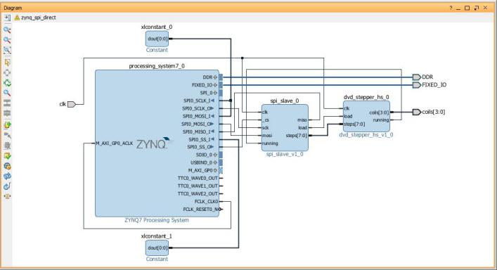
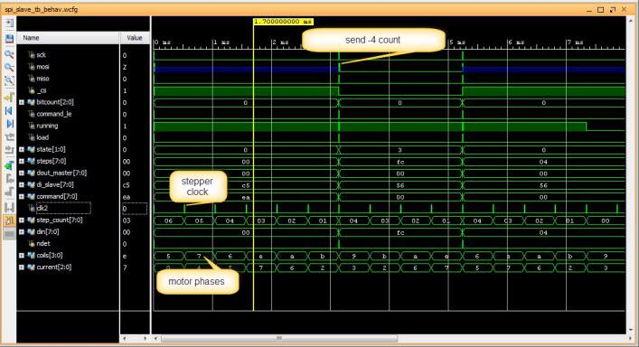

.. title: SPI slave stepper motor with Zybo
.. slug: zybo-spi-stepper
.. date: 2016-11-12 15:38:09 UTC
.. tags: hardware
.. category: 
.. link: 
.. description: SPI slave stepper motor
.. type: text

My previous blog was to create the SPI slave device on Programmable Logic (PL) side of the Zynq7000 where it
can be interconnected and can be accessible by the Processing System (PS) side of this SoC and I achieved the
result I expected. Since that blog was only for validating my SPI slave design to be coherent with the rest of the
system without doing much useful work, I would like to extend it so that I can make it do a bit more useful work.

.. TEASER_END

In the previous blog, I created the SPI slave IP by wrapping it to the AXI bus. The SPI slave Verilog module
was instantiated by the AXI wrapper as the IP and brought into the rest of the board design where it get 
synthesized into the complete system. The generated Xilinx FPGA bitstream is then carried over to the SDK where
the device tree of the design is generated. The device tree was then compiled and loaded to the board by the boot
code for the Linux OS. A simple SPI slave driver was then created to read/write the SPI bus that validated the
interface. 

This blog is about extending the SPI slave that I created for the exercise in the previous blog to do some
useful work, but I will not wrap it with Xilinx's AXI interface as I try to minimize dependency on the external
tool or external IP as much as possible.
For this exercise I will add one extra stepper motor driver in connection to the SPI slave module so that it will 
become a SPI interface stepper motor driver.

Hardware components and tools
------------------------------

. A stepper motor. For this component I can simply salvage a small stepper
motor from a broken Samsung DVD drive. Its eject mechanism was broken, but its stepper motor is still good. 
Once I disassembled it, I could make use of its stepper motor. This stepper motor is the one that drives the
mounted LASER LED assembly for its R/W operations. I only need to solder wires to the pair of the motor coils
that will be driven by the PL in my design. This mechanical preparation should take about 10 to 15 minutes.

. Strip of 4 wires needed for soldering to the motor assembly.

. Soldering iron.

. Digilent Zynq Zybo

. L298 dual H Bridge Motor driver. This is the external driver that is needed to drive the motor since I don't think the Zybo
board will source enough current to drive the motor. It is good to be on the safe side as it also
provides a good electrical isolation to the main board.

Preparing the hardware components
---------------------------------

It was very easy to disassemble the DVD drive. I removed a small DVD stepper from its rail assembly before 
I could solder the wires to the coils. 

.. figure:: ../../images/hardware/dvd-open.jpg

        DVD drive

Once the soldering is done, the stepper motor is reinstalled to the rail assembly the way it was before.
The original flat cable is trimmed since it is no longer needed.

.. figure:: ../../images/hardware/stepper_2.jpg

        Stepper motor before and after soldering with its rail assembly

Software and tools
-------------------

. Vivado 2016.3 for the FPGA design and the synthesis. This is the latest as of this writing.

. GNU Cross toolchain for cross compiling Linux kernel OS.

. Linux SPI kernel device driver `<http://souktha.github.io/software/zynq_spi_stepper_sw>`_ . This is similar to what was done in the my last blog, but with its
functionality extended for command and status processing.

Creating Vivado project
-----------------------

First I need to create two IP modules, one for SPI slave interface and another for stepper motor interface. The SPI slave
interface will be created from directory with just one single file, *spi_slave_if.v*. The same thing is done
for stepper motor interface, one file also, *dvd-stepper-if.v*. 

* Start Vivado and create *spi_stepper_if* project and *dvd_stepper_if* project one at a time.

  - Create an IP for SPI slave interface  using *Tool->Create and Package New IP*.
      The IP are package from */spi_slave_if_sources* where its respective source file, *spi_slave_if.v* is stored.

  - Package the created IP modules then close the project.

  - Repeat the process to create *dvd_stepper_if* IP module.

* Create the zynq system with two newly created IPs.

  -  Create block design with  *Flow Navigator, IP Integragor -> Create Block Design*. Set design name to
      *zybo_spi_stepper*. Accept default, *OK* to continue.

  - On *Design* diagram, add ZYNQ7 Processing System with *Add IP*.

  - Edit *Project Settings*. Add IP repositories to where my SPI IP and stepper IP are located with *Repository Manager*.
      The repositories for these IPs are local to my workspace under the directories where they are created (above).
      This step will enable me to bring in all the custom IPs I created for this exercise into the design.

  - Add *spi_slave_v1_0* from my local IP repository into the design. The name of IP is with the name of the verilog module,not its file name.

  - Add *dvd_stepper_hs_v1_0* from my local IP repository to the design.

  - Edit ZYNQ7 block to enable SPI0 master on EMIO.

  - *Run Block Automation* then  *Run Connection Automation* from the design *Diagram*.

  - Expand *SPI_0* of the ZYNQ7 block to make the following connections (manual) to *spi_stepper_ip_0* block,

    - SPI0_SCLK_O to *sck*

    - SPI0_MOSI_O to *mosi*

    - SPI0_MISO_I to *miso*

    - SPI0_SS_O to *_cs*

  - Using *Make External* to bring out the four signal of  *dvd_stepper_hs's coils* where they will be 
      connected to the stepper motor during design elaboration.

    - Interconnecting the following signals of two new IPs.

      - spi_slave_v1_0's *steps* to dvd_stepper_hs_v1_0's *steps*

      - spi_slave_v1_0's *load* to dvd_stepper_hs_v1_0's *load*

  - Validate the design.

  - Generate Block Design.

  - Create HDL wrapper.

* Open Elaborated Design. Select I/O Ports tab to assign *coils* to Zybo PMOD JE1, JE7, JE2 and JE8 with
  respect to the polarity of the motor coils. According to the board's schematic [5]_, these pins would be,

  - coil[0] -> v12 (JE1)

  - coil[1] -> v13 (JE7)

  - coil[2] -> w16 (JE2)

  - coil[3] -> u17 (JE8)

* Save the new design constraint as *zybo_spi_stepper*.

  - Run Synthesis and fix timing closure as needed.

  - Run Implementation and fix timing closure as needed.

  - Generate bitstream

* Export hardware including bitstream. This part is not necessary since I can use the old device tree generated
      from last exercise. The device tree for zynq PS does not change with respect to this exercise from the last
      exercise.

        
        Block diagram with SPI slave IP and the stepper IP module on Zynq7000

I choose to use the actual board clock, 125MHZ instead of *FCLK_CLKO* from Zynq. According to the data sheet, this clock
is 100MHZ.

HDL for the SPI slave stepper motor
-----------------------------------

For the SPI slave interface module, a bit more code is added to handle the write operation from the SPI master (Zynq).
The write operation is for writing the step count to the stepper module. So for the SPI slave module,

* Expand the functionality of the SPI slave from the last design for the *WRITE* command such that the
  data written from the host is the steps count for the motor. The data is an 8 bit signed that represent
  stepping in either right(positive) or left direction. The sample of the added Verilog code to the original
  *spi_slave* module is shown below.

* Rewrite part of the code to eliminate gated clock.

* Rewrite part of the code so that the state of the SPI is only driven by the master SPI clock. The FPGA main clock feed 
  is still use for the stepper motor interface.

* Pay better attention on timing closure of the design.

Below is the main block of the small SPI slave verilog module. Line 2-5 take the serial data from MOSI on rising SPI clock. Line
7-38 handles the SPI slave state transition from *idle, command input, data input, data output* state. 
Line 49-61 handles input processing for the incoming write step count or the outgoing stepper status. *running* is the state of 
the stepper motor output from the stepper module. It is returned as part of the status read command, *0xea*.
Line 66-77 interfaces to the stepper motor module for the loading of stepper motor count and reading its status. 

.. code-block:: verilog
 :linenos:

    /*state machine transition*/
    always@(posedge sck ) begin
            din <= #`DELAY {din[6:0],mosi};
            bitcount <= bitcount + 1'b1;
    end

    always@(posedge sck, posedge _cs) begin
        if ( _cs )
            state <= IDLE;
        else
        case(state) 
		IDLE: state <= CMD_IN;
                CMD_IN: begin
                    if ( !bitcount && command_le ) begin
				if (command == WRITE )
					state <= DIN;
				else
					state <= DOUT;
		    end 
		    else begin 
                        state <= CMD_IN;
                        end
	        end
		DIN: begin //data from master's MOSI
			if ( !bitcount  ) begin
			 state <= IDLE; //CMD_IN;
                        end
			else
			    state <= DIN;
			end
		DOUT: begin //to master's MISO
			if ( !bitcount ) begin
			 state <= IDLE; //CMD_IN;
			end
			else 
			 state <= DOUT;
                      end
        endcase
    end

    assign miso = dout[7]; 

    /*sample MOSI bits 
    >--01234567---->---01234567----->
     |--------------------------|*/

    /*Transmit MSB first*/

    always@(negedge sck) begin 
            if ( !bitcount ) begin
                 dout <= 8'h0;

                 if (  command_le )  begin
                    if ( din == READ_ID ) dout <= `DEVICE_ID;
                    if ( din == READ ) dout <= 8'hc4 | running;
                 end  //command_le
            end // !bitcount
            else begin
                dout <= {dout[6:0],mosi};
                end
       end

    assign data = din;
    assign load = load_count;

    always@(posedge clk) begin
        if ( command_le )
            command <= din;
        else if (running && din != 8'h0 )
            command <= 8'h0;
    end
    always@(posedge clk) begin
        load_count <= 1'b0;
        if ( (bitcount == 3'b0) && !command_le  && !running )
            if (command == WRITE )
                load_count <= 1'b1;
    end

The simulation of the SPI slave functionality for writing step count command, *0xad* with the count value of 6 is shown below.

.. figure:: ../../images/hardware/stepper_write.JPG 

        Writing(*0xad*) stepper count value *6*.

The stepper driver module is the stand-alone IP that interfaces to the motor driver as shown in the block diagram.
It drives the stepper coils at around 2KHZ for this design. It receives step count from the SPI slave 
interface module and count down to zero while driving the phases of the stepper motor as the count 
being decremented. The stepper steps by the number of count being received from SPI slave module. It outputs *running*
status while the motor is running. The SPI slave use this status as the busy status of the stepper module.

  
.. code-block:: verilog
 :linenos:

    always@(posedge clk) begin
        if ( step_count > 8'h0  ) begin
            if (clk2) begin
                step_count <= step_count - 1'b1;
                `ifdef USE_COMBINATIONAL
                 current <= next;
                 `endif
                end
            end
        else
         begin
         if ( ndet ) begin
            if ( steps[7] )
		     step_count <= ~steps + 1'b1;
		    else
		     step_count <= steps; //infer latch
         end
         else
         step_count <= 8'h0;

         end
    end

   `ifndef USE_COMBINATIONAL

    always@(posedge clk)
        case (current)
             s0: phase <= 4'b0101;
             s1: phase <= 4'b1101;
             s2: phase <= 4'b1001;
             s3: phase <= 4'b1011;
             s4: phase <= 4'b1010;
             s5: phase <= 4'b1110;
             s6: phase <= 4'b0110;
             s7: phase <= 4'b0111;
         endcase

    `else
    assign coils[0] = ~current[2] | (~current[1] & ~current[0]);
    assign coils[1] = current[2] | ( current[1] & ~current[0]);
    assign coils[2] = ~current[1] | ( current[2] & current[0]);
    assign coils[3] = current[1] | (~current[2] & current[0]);
    `endif

    assign running = (step_count > 8'h0 ); //as long as step count > 0

   `ifndef USE_COMBINATIONAL
    always@(posedge  clk)
       if (step_count > 0 && clk2)
       case (current)
            s0: current <= (direction ? s1: s7);
            s1: current <= (direction ? s2 : s0 );
            s2: current <= (direction ? s3 : s1);
            s3: current <= (direction ? s4 : s2);
            s4: current <= (direction ? s5 : s3);
            s5: current <= (direction ? s6 : s4);
            s6: current <= (direction ? s7 : s5);
            s7: current <= (direction ? s0 : s6);
        endcase
   `else
       assign next[0] = (~direction & ~current[2] & current[1]) | 
       (~direction & current[2] & ~current[1]) | 
       (direction & current[2] & current[1]) | 
       (direction & ~current[2] & ~current[1]);
       assign next[1] = (current[1] & ~current[0]) | 
       (~direction & current[2] & current[0]) | 
       (direction & ~current[2] & current[0]);
       assign next[2] = (current[0] & current[2] ) | 
       (~direction & ~current[1] & ~current[0]) | 
       (direction & current[1] & ~current[0] ); 
   `endif

.. figure:: ../../images/hardware/stepper_read_after_write.JPG

        Running status of motor from command *0xea*
      
Both the state machine and the phases of the motor can be implemented with combinational logics, for example, the next state
table below as the function of direction *D* and *current* state.

+----------------------+
| D | Current | Next   |
+======================+
| 0 |  000 | 100       |
+----------------------+
| 0 |  001 | 000       |
+----------------------+
| 0 |  010 | 011       |
+----------------------+
| 0 |  011 | 001       |
+----------------------+
| 0 |  100 | 101       |
+----------------------+
| 0 |  101 | 111       |
+----------------------+
| 0 |  110 | 010       |
+----------------------+
| 0 |  111 | 110       |
+----------------------+
| 1 |  000 | 001       |
+----------------------+
| 1 |  001 | 011       |
+----------------------+
| 1 |  010 | 110       |
+----------------------+
| 1 |  011 | 010       |
+----------------------+
| 1 |  100 | 000       |
+----------------------+
| 1 |  101 | 100       |
+----------------------+
| 1 |  110 | 111       |
+----------------------+
| 1 |  111 | 101       |
+----------------------+

The next state is simplified for their minterms as shown in the HDL code line 61-70. The motor phases are 
derived in the same manner where they are functions of the current state at line 39-42. I achieve the same
result by implementing it with continous assignments as I would with the procedural assignments.

        Simulation of stepper motor control timing

Validating the design and testing
=================================

For this design, I use two separate XDC files to constraint the design. One is for synthesis and the other
is for implementation. The bitstream of the FPGA generated by this design is then loaded to the zynq and 
ready for testing. The kernel is built with the device tree created from my last exercise having the Zynq
SPI master enable and muxed to EMIO. Because there is no change in Zynq h/w configuration in this design
with respect to the last design, I do not have to re-export the h/w to the SDK in order to recreate the 
device tree. 

.. code-block:: 
        :linenos:

        # cat design_3_wrapper.bit >/dev/xdevcfg 
        # insmod spi5a.ko 
        spi max speed HZ: 1000000
        spi read ID for cs 0, mode 0, bpw 8
        Detected SPI Stepper ID 0x5a
        spi5a_probe read(ea) returns 0xc4
        # cat /proc/stepper/status 
        0xc4
        # echo '0x44'>/proc/stepper/steps && cat /proc/stepper/status 
        proc_stepcount_write: sbuf dd9b5e50, wrote step count 0x44, status 0 
        0xc5
        # 

Loading FPGA bitstream to zynq (line 1) and load the Linux SPI slave driver written for this design (line2). The SPI slave
detects the newly instantiated h/w just fine so it prints out the status of that detection (line 3-6). I write the command
to load the step count value *0x44* to the stepper drive and immediately read the status back where it indicates that
the motor is running wih status *0xc5*. I observe that the stepper is stepping for the given count.

Conclusion
===========

The most time consuming part of this design is the timing closure. I think it is almost always true in general 
where the HDL design only account for only fraction the amount of time to close the design. Vivado design suite also allows
me to successfully creates and integrates the custom IPs without the need to use Xilinx AXI as done in my previous post.

Citations
==========

.. [1] Zybo(TM) FPGA Board Reference Manual, zybo_rm.pdf, Februrary 2013, Zybo rev B, Digilent.

.. [2] Zynq-7000 All Programmable SoC Techincal Reference Manual, ug585-Zynq-7000-TRM.pdf, Feb 2015, Xilinx.

.. [3] Zynq-7000 All Programmable SoC Embedded Design Tutorial, UG1165(v2015.3), ug1165-zynq-embedded-design-tutorial.pdf, Sept 30 2015, Xilinx.

.. [4] Zybo FPGA Board Reference Manual, Revised Feb 2013, Rev B, Digilent Inc.

.. [5] Zybo(TM) FPGA Board Schematic, zybo_sch.pdf, 5/7/2015, rev B.3, Digilent Inc.

