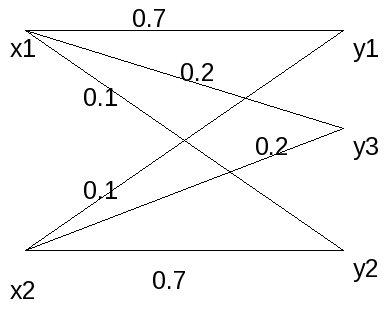

.. title: LaTeX conversion
.. slug: class_report_503
.. date: 2016-03-08 15:56:21 UTC
.. tags: misc, mathjax, latex
.. category: 
.. link: 
.. description: 
.. type: text
.. author: Soukthavy

======================================================
Convert a small LaTeX file to mathjax supported format
======================================================

.. Converting my old LaTeX file to reST format requires a bit of editing. Unless I did something wrong, cut-n-paste mode is not working, for example, I cannot get this to work,

.. .. code-block::

..         .. raw: latex

..                 \begin{equation}
..                 \phi(y_j,x_i)  = \frac{p(x_i|y_j)p(y_j)}{\sum_{k=1}^{n}p(x_i|y_k)p(y_k)}
..                \end{equation}

.. instead,

.. .. code-block::

..         .. math::

..                 \phi(y_j,x_i)  = \frac{p(x_i|y_j)p(y_j)}{\sum_{k=1}^{n}p(x_i|y_k)p(y_k)}

                 
.. works. Most of editing involves deleting and indenting. Later I will figure out how to do multi columns in IEEE format.

:Author: Soukthavy Sopha
:Contact: soukthavy@yahoo.com
:organization: self
:status: Lean to convert the LaTex of IEEE format to reST using my old class homework.
:revision: 0.1
:copyright: None
            
:abstract:

        The Arimoto-Blahut algorithm is the algorithm used to solve the convex optimization problem
        for the maximum capacity of a discrete memoryless channel. We will implement their algorithm with
        MATLAB script to solve the given problem.

.. TEASER_END

.. meta::
        :keywords: arimoto-balhut, arimoto, channel
        :description lang=en: A demonstration of converted a small LaTex document.

.. section-numbering:: 

Introduction
============

For the discrete memoryless channel, Shannon's maximum channel capacity is:

        
.. math::      

         C = max_{p_1 \cdots p_n} I(X,Y)
         
where X and Y are random variable representing the input and output respectively. The optimization is
taken all over the input probability distribution :math:`p = (p_1 \cdots p_n)` with the constraints :math:`p_i \ge 0, \sum_{j=1}^{n}p_j = 1` and the mutual information is defined as:

.. math::

        I(X,Y) = \sum_{i=1}^{m}\sum_{j=1}^{n} p(x_i|y_j)p(y_j) log\frac{p(x_i|y_j)}{\sum_{k=1}^{n}p(x_i|y_k)p(y_k)}

The optimal :math:`p` gives the distribution on the input symbol required to achieve the channel capacity.

Description of the algorithm
============================

We reformulate the algorithm by introducing variable :math:`\phi(y_j,x_i)`, and define:

.. math:: 

        J(p,P,\phi) = \sum_{i=1}^{m}\sum_{j=1}^{n}p(x_i|y_j)p(y_j)log\frac{\phi(y_j|x_i)}{p(y_j)}

and for fix :math:`p`

.. math:: max J(p,P,\phi) = \sum_{i=1}^{m}\sum_{j=1}^{n}p(x_i|y_j)p(y_j)log\frac{p(x_i|y_j)}{\sum_{k=1}^{n}p(x_i|y_k)p_{y_k}}

where we attain at

.. math:: \phi(y_j,x_i)  = \frac{p(x_i|y_j)p(y_j)}{\sum_{k=1}^{n}p(x_i|y_k)p(y_k)}

and the channel capacity

.. math::

         C = max_p max_\phi J(p,P,\phi)

for fixed :math:`p,  max_p J(p,P,\phi)` is maximized when

.. math::
         p_j = \frac{exp(\sum_{k=1}^{m}p(x_k,y_j)log\phi(y_j|x_k)}{\sum_{i=1}^{n}exp(\sum_{k=1}^{m}p(x_k|y_l)log\phi(y_l,x_l)}

The algorithm is to alternatingly finding the optimal :math:`\phi` for a given :math:`p` and the optimal :math:`p` for a given :math:`\phi`

Implementation
--------------

1. Choose an initial :math:`p^i` vector then iterate the following steps from :math:`t=1,2,\cdots`
2. Maximize :math:`J(p^t,P,\phi)` with respect to :math:`\phi`. The maximized :math:`\phi` :math:`\phi_j^t = \frac{p(i|j)p_j^t}{\sum_{k=1}^{n}p(i|k)p_k^t}, for j=1 \cdots n`

3. Maximize :math:`J(p,P,\phi^t)` with respect to :math:`p` by

.. math::

        p_j^{t+1} = \frac{r_j^t}{\sum_{k=1}^{n}r_k^t}, j = 1 \cdots n

where

.. math::

        r_j^t = exp(\sum_{i=1}^{m}p(i|j)log\phi^t(j|i)), j=1 \cdots n

Problems
========

..        \begin{figure}[here]
..        \includegraphics[width=2.0in]{3-27a.jpg}
..        \caption{Problem 3.27a}
..        \end{figure}

The transition probability for Fig 1 is:

.. math::

        P = 
        \left[
        \begin{array}{cc}
         0.7 & 0.1 \\
         0.1 & 0.7 \\
         0.2 & 0.2
        \end{array}
        \right]
        
Maximum channel capacity = 0.365148

.. figure:: ../../images/misc/3-27c.jpg
        :alt: Fig 2 (problem 3.27c) using figure directive

..        \includegraphics[width=2.0in]{3-27c.jpg}
..        \caption{Problem 3.27c}
..        \end{figure}

The transition probability for Fig 2 is

.. math::
        
        P =
        \left[
        \begin{array}{ccc}
         0.7 & 0 & 0.25 \\
         0.25 & 0.75 & 0 \\
         0 & 0.25 & 0.75
        \end{array}
        \right]

Maximum channel capacity = 0.773684

..        \begin{figure}[here]
..        \includegraphics[width=2.0in]{3-27d.jpg}
..        \caption{Problem 3.27d}
..        \end{figure}

.. image:: ../../images/misc/3-27d.jpg
        :alt: Fig 3 (problem 3.27d)
        
The transition probability for Fig 3 is:

.. math::

        P = 
        \left[
        \begin{array}{cc}
         0.9 & 0.3 \\
         0.1 & 0.7
         \end{array}
        \right]

Maximum channel capacity = 0.296672

Conclusion
==========

This exercise gives us a good examples on solving the discrete memoryless
channel for its optimum value of probability distribution to achieve the maximum
channel capacity.

Bibliography
============

.. Hamidian, EGEE503 Information Theory and Coding,CSUF, Class note spring 2010.

.. [CIT002] Lawrence Ip, The Blahut-Arimoto Algorithm for the Calculation of the Capacity of a Discrete
        memoryless channel, December 10 1999.

.. [CIT003] H.~Kopka and P.~W. Daly, \emph{A Guide to \LaTeX}, 3rd~ed.\hskip 1em plus
          0.5em minus 0.4em\relax Harlow, England: Addison-Wesley, 1999.

.. [CIT004] Various books and articles from various authors

..        % that's all folks
..        \end{document}

