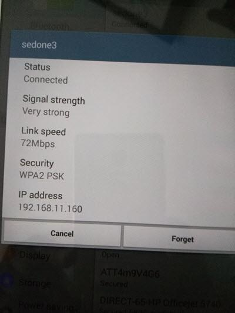

.. title: Create Wireless AP on Linux PC in 10 minutes
.. slug: create-ap-linuxpc
.. date: 2017-01-15 19:14:05 UTC
.. tags: misc
.. category: 
.. link: 
.. description:  Creating wireless access point on linux PC
.. type: text

Creating a wireless access point aka WiFi AP is relatively easy. A typical PC
usually has at least one networking device or maybe two. One would be an Ethernet
device while the other would be a WiFi device. If the ethernet device is tethered 
into the router already, this leaves WiFi device unused as in my case. Instead of 
leaving it in a useless state, I choose to create a WiFi AP out of it.

.. TEASER_END

Okay, maybe I lie. It might take more than 10 minutes for somebody else because 
it all depends on whether or not they have the software tools that are needed for
this process. Adding time to build the tools will certainly makes it longer than
10 minutes mark. All the tools needed are readily available in the OpenSource 
community.

Hardware requirment
-------------------

* An ethernet device. 10/100/1000Mbps is common.

* A wireless device. Verify with command *iw list* that *AP* mode is supported.
  The faster WiFi chip, the better.

* A router that connects to service provider for internet access. This will use to
  verify the internet access of the wireless AP later. This router is normally
  connected to DSL modem or Cable modem in a typical home environment.

* A Linux PC, of course. This is the base platform to host this process.

Linux Kernel requirement
------------------------

Most of the stock Linux distribution will have ethernet bridging and netfilter already built
and installed. If this is not the case, these configurations need to be enable. I enable
these features since I build and customize my own Linux PC. For this exercise I use
the released distribution Slackware 14.2 (linux-4.4.14) that has all the pre-built kernel
features.

Required software packages
--------------------------

Aside from the kernel requirements, these are the required software packages:

* Bridge utility, *bridge-utils*. This package offers *brctl* utility to create networked bridge
  devices. I use *bridge-utils-1.5* for this process.
  
* dnsmasq utility, *dnsmasq*. This package offers DHCP,DNS service to the small network infrastructure.
  Only DHCP feature is needed for this process. I use *dnsmasq-2.76* for this process.

* hostapd utility, *hostapd*. This package is an access point daemon, *hostapd*. It offers authentication 
  services between host PC and wireless clients. I use *hostapd-2.4* for this process.

* iptables utility, *iptables*, a netfilter utility. Most usually included in the distribution.
  *iptables-1.6.0* is included in my distribution.

* wifi utility, *iw*, to set/get wifi networking device. *iw-4.3* is included in my distribution.

Bridge utility, dnsmasq, hostapd are not usually included with the distribution. In that case 
they needed to be downloaded and be built for this process.

The configuration of my network
-------------------------------

* *eth0*, an Intel E1000e Ethernet of my PC connects to the router that connects to the DSL modem which gives me 
  the internet access.

* *wlan0*, an Atheros AR9300 Rev:3 (TP-LINK). Not used before, but it is to be made into a wireless AP. This is
  a PCIe HBA that I added to my desktop PC. I do not remember how long ago I had it in the PC. It 
  must be at least 4-5 years old or more. I think it is an 80211n HBA, definitely not an 11ac.

Summary of process
------------------

* Create a bridging device, say *br0* (or any name). I prefer bridge device option since it
  is extensible, for example, if I have a second ethernet card, say, *eth1*, I can 
  bond it to the bridge and become part of the AP network and governed by the same IP tables
  rules, less headache later.

* Bond wifi device, *wlan0* to the *br0* bridge device.

* Verify to make sure that the WiFi device, *wlan0*, is at the right regulatory domain. My
  *wlan0* comes up in what I think is Australia domain (AU). I need to set it to US-FCC domain.
  This is important or the WiFi may not work correctly due to its frequency assignments and 
  its Tx/Rx power settings that vary by region of the world.

* Enable IP forward. Usually this is off by default.

* Enable bridge device.  

* Run dnsmasq daemon to service DHCP/DNS with the right configuration.

* Run hostapd with the right configuration ie.. authentication security settings.

* Set up IP tables for devices forwarding and masquerading.

Details in step-by-step
------------------------

It is better to login as root to do this as I am doing it manually instead of putting it
in a shell script. Once I login as root,

* First this is my network devices. Wireless device would not show up if Linux kernel
  is not supported it. In that case, the vendor's driver will need to ported, compiled, and
  loaded.

  .. code-block::

        cat /proc/net/dev
        Inter-|   Receive                                                |  Transmit
         face |bytes    packets errs drop fifo frame compressed multicast|bytes    packets errs drop fifo colls carrier compressed
            lo:    1504      22    0    0    0     0          0         0     1504      22    0    0    0     0       0          0
         wlan0:       0       0    0    0    0     0          0         0        0       0    0    0    0     0       0          0
          eth0:  364234    2479    0    0    0     0          0         0   350453    3161    0    0    0     0       0          0

* Set regulatory domain of *wlan0* to meet US FCC regulation (in my case) and set WDS mode,

  .. code-block::

        #iw reg set US
        #iw dev wlan0 set 4addr on 

The regulatory domain is important because it is used for the setting of radio frequency
allowed in the host country. WiFi driver or firmware will use it for radio calibration settings
that is needed for Tx/Rx power limit, frequency channels allowed (carrier and subcarriers etc).
The first line above makes the driver use the US look-up table for its operational settings.

* Create bridge *br0*, and add *wlan0* interface to bridge,

  .. code-block::

        #brctl addbr br0
        #brctl addif br0 wlan0
        #
        #brctl show
        bridge name     bridge id               STP enabled     interfaces
        br0             8000.e8de27191e83       no              wlan0

Only *wlan0* need to be added. If extra *eth* device is available and wish to be bonded
as part of the new network, it  can be added as well (as LAN segment), but not *eth0* since it is 
considered to be *WAN* for this setting. In another word, do not bond eth0 to bridge !

*  Enable IP forwarding,

  .. code-block::

        # sysctl -w net.ipv4.ip_forward=1
        net.ipv4.ip_forward = 1
        
* Assign IP address to *br0* device. I choose 192.168.11.1 for my WiFi AP.

  .. code-block::

        #ifconfig br0 192.168.11.1 up

All the routing will be shared with the *eth0* and will be netfiltered into it next.
The IP network address 192.168.11.1 is my new bridged WiFi network.

* Start dnsmasq,

  .. code-block::

        #dnsmasq -C dnsmasq.conf

The *dnsmasq.conf* is a configuration file for dnsmasq in my current directory where I start it,

  .. code-block::
        :linenos:

        domain-needed
        bogus-priv
        resolv-file=/etc/resolv.conf
        interface=br0
        expand-hosts
        dhcp-range=set:br0,192.168.11.100,192.168.11.199,255.255.255.0,86400
        dhcp-lease-max=160
        address=/souktha.github.io/192.168.11.1

dnsmasq will serve DHCP to all WiFi clients by assigning them with network IP address `192.168.11.x`_ . 
The interface for the bridge is *br0* (line 4). This has to match the name of the bridge
I created earlier. The DHCP address range it will give to clients will be in the range 
of x.100 - x.199 (line 6).

* Start hostapd using hostapd.conf file which is also in my current directory. I can set up IP tables rules 
  later. hostapd will set *wlan0* to AP mode. 

 .. code-block::

        #hostapd hostapd.conf
        Configuration file: hostapd-sedone.conf
        wlan0: interface state UNINITIALIZED->COUNTRY_UPDATE
        wlan0: interface state COUNTRY_UPDATE->HT_SCAN
        20/40 MHz operation not permitted on channel pri=6 sec=10 based on overlapping BSSes
        Using interface wlan0 with hwaddr e8:de:27:19:1e:83 and ssid "sedone3"
        wlan0: interface state HT_SCAN->ENABLED
        wlan0: AP-ENABLED 
        

For this test, I do not run hostapd in background (-B) mode so I can debug if I need to.
This is *hostapd.conf* file,

        .. code-block::
         :linenos:

         interface=wlan0
         bridge=br0
         logger_syslog=127
         logger_syslog_level=2
         logger_stdout=127
         logger_stdout_level=2
         ctrl_interface=/var/run/hostapd
         ctrl_interface_group=0
         ssid=sedone3
         hw_mode=g
         macaddr_acl=0
         auth_algs=1
         ieee8021x=1
         eapol_key_index_workaround=0
         eap_server=1
         country_code=US
         channel=6
         beacon_int=100
         hw_mode=g
         wpa=2
         ieee80211n=1
         wme_enabled=1
         ht_capab=[SHORT-GI-20][SHORT-GI-40][HT40+]
         wpa_key_mgmt=WPA-PSK
         wpa_pairwise=CCMP
         max_num_sta=8
         wpa_group_rekey=86400
         wpa_passphrase=87654321
         upnp_iface=br0
         friendly_name=sedone3
         model_description=Slackware WiFi AP

Line 9 is my AP's SSID, *sedone3*. The authentication password is at line 28. Basically from line 20 down
(minus a few), are the settings for security features such as key exchange, authentication mode etc..

At this point I can browse/scan the WiFi AP and I will see *sedone3* as its SSID, but
packets are not yet routed; however, my android tablet can connect to it.

.. figure:: ../../images/misc/sedone3-ssid.jpg

        Fig1: *sedone3* is SSID of my router

.. figure:: ../../images/misc/sedone3-passwd.jpg        

       Fig2: *sedone3* password prompt

.. _192.168.11.x:

       Fig3: *sedone3* connected

* Now set the IP tables rules for package forwarding,masquerading. This is essential to
  get network properly covered.

.. code-block::

        # iptables -A INPUT -i br0 -j ACCEPT
        # iptables -A FORWARD -i br0 -o eth0 -j ACCEPT
        # iptables -A FORWARD -o br0 -i eth0 -j ACCEPT
        # iptables -t nat -A POSTROUTING -o eth0 -j MASQUERADE
        # iptables -A FORWARD -o br0 -i eth0 -m state --state RELATED,ESTABLISHED -j ACCEPT

        Fig4: Internet access after IP netfilter forwarding,masquerading.

The setting above is to add bridge device to the rule and forward packets between
bridge device and the main ethernet device (WAN or eth0) with masquerading.

Route for the new network is shared with *eth0*'s default gateway. There is
no special setting for the route. Here is my route,

.. code-block::

        #route 
        Kernel IP routing table
        Destination     Gateway         Genmask         Flags Metric Ref    Use Iface
        default         netrouter       0.0.0.0         UG    1      0        0 eth0
        loopback        *               255.0.0.0       U     0      0        0 lo
        192.168.10.0    *               255.255.255.0   U     0      0        0 eth0
        192.168.11.0    *               255.255.255.0   U     0      0        0 br0

The IP netfilter rules added are the rules
added on top of what I already have for my local *eth0* network. I did not flush my
host IP tables so whatever rules I have I still keep them, just the new rules for
the WiFi bridge are added.
More IP filter rules can be added specifically for this network if needed.

I am not sure how many Mbps my *wlan0* can reach so I leave it at default of 72Mbps.
Most newer PCIe WiFi card will probably reach Gbps speed, but mine is relatively old. Perhaps
it can reach in the hundreds Mbps. 

Conclusion
-----------

*dnsmasq* and *hostapd* do all the magic here. Unlike my other posts, I do not write
a single line of code. I do not debug, perform timing closure (FPGA) or do any frustrated things.
Is it hard ? Well, It takes me a lot longer to write this post than to set up the 
WiFi AP on my host PC. It really take 10-15 minutes to set it up since I did not 
spend time building the needed packages.
For most Linux distribution, one can download/install the pre-built binary packages with the
host package manager software, for example, Ubuntu's apt-get install <package> command. It 
is not necessary to build everything like I did.

There are many choices of WiFi routers out there in the store shelves; however, regardless of how 
expensive they are, their set up to make a WiFi router is almost identical to this post. More than
that are just bell and whistle to turn simple thing into deep shit.
How fast and how far is all about the WiFi chip set in that box.
