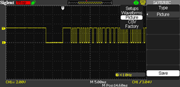

.. title: Creating an IR receiver on AM335x BeagleBone Black
.. slug: bblk-ir
.. date: 2016-04-02 15:39:02 UTC
.. tags: software
.. category: 
.. link: 
.. description: 
.. type: text

What I like about working with TI based platform is their easily accessible documentations. It is by far the most
developers friendly unlike other chip vendors. This accessibility has enable me to experiment with the on-chip I/O
subsystem components.

.. TEASER_END

TI OMAP AM335x [1]_ has wealth of I/O devices that can be put to good use. Among various supported I/O devices are six UART devices.
Among these six UARTs, I think only UART0 is used for serial port routed to the 6-pin header, J1. The rest of them share with
other I/O devices by multiplexing (pinmux). I want to create and IR receiver from one of the remaining UART devices and I choose
to use UART4 for that. The reason being that UART4 is routed to P9 and can be pinmuxed to make use of it. Its RXD will be at 
pin 11 of P9. Should I choose UART5, it will conflict with LCD muxed pins. Table 13 [2]_ of the BBLK shows UART4_RXD right at 
the stop just below *sys_resetn*, this too caught my attention. It is just the one that pops up get to be picked and I decide to
write the Linux IR device driver for it.

IR receiver
===========

There are various IR receiver device drivers readily available in the kernel and they work in most cases. Most of them support
mainstream IR devices that are commercially available. In the Linux device drivers structure, the IR is a subcategory of media device drivers. 

IR device
---------

For this work, I am using a VS1838B IR receiver having three pins, power, ground, and output. I do not even have the datasheet of it. I hook
it up and get the scope output and from what I see I know that it will work for what I want to do.

      
        IR signal from its output pin

This device is probably equivalent to TSOP4838 or TSOP1738 type of IR receiver, an integrated circuit with AGC and BP filter.

.. figure::     ../../images/hardware/connecting-ir.jpg

        This is how easy it is to connect. Two pins plug straight to header with the signal pin to UART4_RXD.

Tools, software and accessory 
=================================

- IR receiver
- Wires
- Any IR remote controller transmitter (from old VCR or old TV etc..)
- v4l-utils tool, ir-keytable for testing.
- BeagleBone Black  

Implementation
==============

pinmuxing
----------

The IR driver will be running on the current kernel version of my BBLK board which is 4.1.13. The kernel source file is in *am335x-evm-sdk-src-02.00.01.07* of TI.
First thing I need to do is to redo pinmux for *T17* (Table 4.1, page 29) [4]_. *T17* is the ball pin of Am3358, not the BBLK P9's header pin. On P9 it is pin 11.
This is the pin for UART4_RXD. For this pin to function as UART4_RXD, it needs to be muxed to mode 6 of operation.
To pinmux, I need to edit the device tree source, am335x-boneblack.dts, and add to '&am33xx_pinmux' block to override their default settings.
I do not need TX operation of this UART since it is only for RX operation.

.. code-block::
        
       &am33xx_pinmux {
                ..
         
                uart4_pins: pinmux_uart4_pins {
		pinctrl-single,pins = <
			0x70 (PIN_INPUT_PULLUP | MUX_MODE6)	/* uart4_rxd.uart4_rxd*/ 
		>;
	       };
        };

I also need to enable UART4 that was defined, but was marked disabled otherwise I will not be able to use it. I can override this setting by
adding the following to the dts file,

.. code-block::

        &uart4 {
	        pinctrl-names = "default";
        	pinctrl-0 = <&uart4_pins>;
        	compatible = "cir-uart";
        	status = "okay";
        };

So I add the block shown above just below '&mcasp0' block. This is to set 'uart4' to use the pinmux that I define and set its status to be okay (enable).
I also set the platform driver compatibilty to 'cir-uart'. This is going to be my new IR driver. The platform driver will invoke my driver upon
*insmod*. I am done with pinmuxing and enabling UART4 device as far as device tree is concerned.

I recompile the device tree and add to the zImage as an FDT. On reboot, the new MUX will take effect.
The simple part is done, now come the hard part. Getting the UART4 to work the way I want to.

kernel driver
-------------

In reference to TI's AM335x [1]_, chapter 19, Universal Receiver/Transmitter, the clock for this UART is the external *PER_CLKOUTM2* *PRCM / 4* that feeds the UART's *fclk*.  The UART has to be clocked for the driver to be able to access its registers and configure it for use. 

The first thing this driver does is to register with the kernel platform framework having this *platform_driver* table,

.. code-block:: c
 :linenos:

        static struct platform_driver cir_platform_driver = {
	        .driver = {
		.name		= "cir-uart",
		.of_match_table = cir_dt_ids,
	        },
	        .probe			= cir_probe,
	        .remove			= cir_remove,
        };

The *cir-uart* matches to what I defined in the device tree earlier. The will enable the platform driver framework to call 
its *cir_probe* for device probing and initializing the device. 

.. code-block:: c
 :linenos:

        static int cir_probe(struct platform_device * pdev)
        {
                ...	
        	
        	struct resource * regs = platform_get_resource(pdev, IORESOURCE_MEM, 0);
        	struct resource * irq = platform_get_resource(pdev, IORESOURCE_IRQ, 0);
                ...
        	/* use uart4_fck*/
	        clk = clk_get(&pdev->dev,"dpll_per_m2_div4_ck"); //expect 48MHZ clock feed 
                ..

        	device_init_wakeup(&pdev->dev, true);
	        pm_runtime_use_autosuspend(&pdev->dev);
        	pm_runtime_set_autosuspend_delay(&pdev->dev,-1);
	        pm_runtime_irq_safe(&pdev->dev);
        	pm_runtime_enable(&pdev->dev);

	        pm_runtime_get_sync(&pdev->dev);

        	cirdev->clk = clk;
	        clk_prepare_enable(clk);
	
The device probe get the device resource information from the platfrom framework. I look up the source
code in *arch/arm/mach-omap2* to find out the name of the clock that is the most likely be the one I should be
using. This happens to be *dll_per_m2_div4_ck* clock. The driver will get this clock line, wakeup the device and 
ask *pm_runtime..* to put it into use. The remaining part is the typical drill, memory mapped I/O device, request IRQ
line etc.. 

Next the driver allocates RC device structure, fills in the RC device operations and its information and register
for service with the RC framework driver. In the RC device structure, I have mostly empty functions
defined since the device does not need special handling. It is only for the formality. I have it mapped to
*RC_MAP_RC6_MCE*, but it can be changed at run-time. Work queue is also used for this
driver for input event processing as the BH portion of interrupt handling.

.. code-block:: c
 :linenos:

	ir_props = rc_allocate_device();
        ..
	ir_props->driver_type = RC_DRIVER_IR_RAW;
	ir_props->allowed_protocols = RC_BIT_ALL;
	ir_props->priv = (void * )cirdev;
 	ir_props->s_idle = cir_set_idle;
	ir_props->open = cir_open;
	ir_props->close = cir_close;
        ..
	ir_props->map_name = RC_MAP_RC6_MCE;
        ..
	INIT_WORK((struct work_struct * )&cirdev->bh,irevent_bh);
	INIT_LIST_HEAD((struct list_head * )&cirdev->head);

	err = rc_register_device(cirdev->irprops);
	
The UART is at the reset state and won't get initialized until the RC called its *cir_open()* operation. This will happen
when */dev/input/eventx* is opened by external application to make use of it.

Once the IR stream bits is received and decoded by the UART, the RX interrupt will be generated and will be serviced
by *cir_irq_handler* interrupt handler. The handler put the received byte into the buffer and schedule the BH workqueue.
The BH handler then takes the byte off from the buffer and pushes it upstream to the IR core driver.

.. code-block:: c
 :linenos:

        ..
	if ( (pulse == 0) || (pulse == 0xff) ) {
		ev.pulse = pulse ? 1 : 0 ;
		ev.duration = (protocol == RC_TYPE_SONY12 ) ? 600000 * 8: 562500 * 8 ;
		ir_raw_event_store_with_filter(cirdev->irprops, &ev);
		continue;
	}

	for (j = 0; j < 8; j++) {
		ev.pulse = pulse & 1;
		pulse = pulse >> 1;
		if (protocol == RC_TYPE_SONY12) {
			ev.duration = 600000 ; //duration * 1000; //in ns
		}
		else
			ev.duration = 562500; //duration * 1000; //in ns
			ir_raw_event_store_with_filter(cirdev->irprops, &ev);
		}
	         ..
	ir_raw_event_handle(cirdev->irprops);
	
For simplicity, I omit the sleep/wakeup support in the driver, instead I add proc file interface for 
debugging purpose. The proc file is a simple registers dump using sequential file mechanism.

.. code-block:: c
 :linenos:

        struct file_operations proc_regs_fops = {
        	.open =  proc_seq_open,
	        .read = seq_read,
	        .llseek = seq_lseek,
	        .write = proc_reg_write,
	        .owner = THIS_MODULE,
        };
        ..

	if (!(cir_procdir_entry = proc_mkdir("cir",NULL))) {
		goto exit_free_data;
	}
	cirdev->proc_entry = cir_procdir_entry;
	if (!(entry = proc_create_data("regs",S_IFREG | S_IRUGO | S_IWUSR,
								   cirdev->proc_entry,
								   &proc_regs_fops,
								   NULL)) ) {

Once I compile the driver, *cir.ko*, I can load and test it. As part of input event, the input event driver, *evdev* is also used.

.. code-block:: console
        
        # modprobe evdev 
        # insmod cir.ko 

Testing
=======

Having the debug code, upon driver loading I can see that the platform framework call it with,

.. code-block:: console

        # insmod ci# insmod cir.ko 
        [   40.972690] cir_probe: entering with regs start 0x481a8000, size 0x2000, irq 156
        [   40.980266] cir_probe:uartclk 48000000, wakeirq 0, id   (null), sbase 0xfa1a8000, mapbase 481a8000
        [   40.990945] cir_probe: fck rate 48000000
        
So far so good. My debugging messages indicate that I get the UART4 resource information correctly.To make sure I get what
I think I really get is to add few extra debug code to actually read the AM3358 registers [1]_ just to verify the setting.

.. code-block:: console

        [   99.034228] get_uart_clock, CM_PER_L4LS_CLKCTRL=0x4502
        [   99.039409] get_uart_clock, CM_PER_UART4_CLKCTRL=0x2
        [   99.045336] get_uart_clock: MDR1 reg = 0x7, CFPS 0x69

The first two lines is the value of *CM_PER_L4LS_CLKCTRL* [1]_ and *CM_PER_UART4_CLKCTRL* respectively. This is the 
indication that clock line is activated correctly. The last line is to read two UART registers, *MDR1* and 
*CFPS*. If clock line is not activated, reading the two UART registers would have resulted in kernel crash
because the IO bus would be stuck and cause I/O fault to happen. It is the painful way to know something is wrong.

I can check IRQ45 of UART4 is registered with the kernel correctly.

.. code-block:: console

        # cat /proc/interrupts 
                   CPU0       
         16:       3050      INTC  68 Level     gp_timer
         ...
        156:          0      INTC  45 Level     cir
        ...

There is my interrupt handler and current count is at 0. While at it I can check my proc file for registers dump at
the device's idle state.

.. code-block:: console

        # cat /proc/cir/regs 
        rhr                      0x44
        acreg                    0x10
        ..

Having verify the information that I expect, I have more confident to do further test. The next step is to
test with *ir-keytable* utility.

.. code-block:: console

        # ir-keytable 
        Found /sys/class/rc/rc0/ (/dev/input/event0) with:
                Driver (null), table rc-rc6-mce
                Supported protocols: unknown other lirc rc-5 jvc sony nec sanyo mce-kbd rc-6 sharp xmp 
                Enabled protocols: lirc rc-6 
                Name: CIR Infrared Remote Receiver
                bus: 0, vendor/product: 0000:0000, version: 0x0000
                Repeat delay = 500 ms, repeat period = 125 ms
         
Looks like the tool recognize the registered IR device. I will change to use SONY protocol instead of 
*lirc rc-6* so I issue this command,

.. code-block:: console

        # ir-keytable -c -p SONY
        Old keytable cleared
        Protocols changed to sony 
        # ir-keytable 
        Found /sys/class/rc/rc0/ (/dev/input/event0) with:
                Driver (null), table rc-rc6-mce
                Supported protocols: unknown other lirc rc-5 jvc sony nec sanyo mce-kbd rc-6 sharp xmp 
                Enabled protocols: sony 
                Name: CIR Infrared Remote Receiver
                bus: 0, vendor/product: 0000:0000, version: 0x0000
                Repeat delay = 500 ms, repeat period = 125 ms

So far so good. Next is to run the test with the IR receiver and SONY based remote control I found 
in my junk box.

.. code-block:: console

        # ir-keytable -t 
        Testing events. Please, press CTRL-C to abort.
        1214.743017: event type EV_MSC(0x04): scancode = 0x19000a
        1214.743017: event type EV_SYN(0x00).
        ...
        218.540761: event type EV_MSC(0x04): scancode = 0x19000b
        1218.540761: event type EV_SYN(0x00).
        1218.585536: event type EV_MSC(0x04): scancode = 0x19000b

Scan code of SONY remote control is detected and decoded. For *power* button it is 0x1900a and for *menu*
button it is 0x19000b. With this information, I can create the keymaps for it. Luckily this remote control
has only a small number of buttons so it is created quickly. I store this keymap file as *sony* in 
*/etc/rc_keymaps*.

.. code-block:: console

        # cat /etc/rc_keymaps/sony 
        0x19000a KEY_POWER
        0x19000b KEY_MENU
        0x19000c KEY_UP
        0x19000d KEY_REWIND
        0x19000e KEY_ENTER
        0x19000f KEY_FORWARD
        0x190010 KEY_DOWN

Next I load the keymap mapping for the next test.

.. code-block:: console

        # ir-keytable -c -p sony -w /etc/rc_keymaps/sony  
        Old keytable cleared
        Wrote 7 keycode(s) to driver
        Protocols changed to sony 
        # ir-keytable -t 
        Testing events. Please, press CTRL-C to abort.
        1608.313105: event type EV_MSC(0x04): scancode = 0x19000a
        1608.313105: event type EV_KEY(0x01) key_down: KEY_POWER(0x0001)
        1608.313105: event type EV_SYN(0x00).
        ...
        1613.269840: event type EV_MSC(0x04): scancode = 0x190010
        1613.269840: event type EV_KEY(0x01) key_down: KEY_DOWN(0x0001)
        1613.269840: event type EV_SYN(0x00).

Now that I can see that the key events are generated with respect to their scancodes. Changing
protocol to match the type of remote control is also flexible, for example, I can change
protocol to NEC, *nec* to use with an old TV remote control that uses NEC protocol,

.. code-block:: console

        # ir-keytable -c -p nec
        Old keytable cleared
        Protocols changed to nec 
        # ir-keytable -t 
        Testing events. Please, press CTRL-C to abort.
        2280.369927: event type EV_MSC(0x04): scancode = 0x847904
        2280.369927: event type EV_SYN(0x00).
        2285.859057: event type EV_MSC(0x04): scancode = 0x84790a
        2285.859057: event type EV_SYN(0x00).

Should I need to use this remote control, I would want to create the keymap for its scancodes; however,
this remote control has too many buttons, I will not create keymap for it for the time being. The scancodes
above are for *play* and *stop* buttons respectively. They would be mapped to *KEY_PLAY* and *KEY_STOP* of
the map file.

Conclusion
==========

While there are many choices to use the IR of this type. One would be the GPIO type of driver to handle the
IR stream, perhaps bit-banging it. If there is a small piece of hardware that left unused, it is better
to use it. Since it is already included in the cost of the product, I better find the use of it.

This driver is available in my github repository, https://github.com/souktha/ir. There is a lot of room to
improve and it is not yet robust. If I load/unload multiple times, it would crash. Once I have enough time
in my hand, I will fix it. Perhaps it is because I oversimplify it by ignoring certain aspect of *pm_runtime*.

Citations
=========

.. [1] AM335x Sitara Processors Technical Reference Manual, Literature number: SPRUH73M, October 2011 - Revised January 2016, Texas Instruments.  

.. [2] BeagleBone Black System Reference Manual, Revision C.1, May 22, 2014, Gerald Coley, Robert P J Day (BBB_SRM.pdf)

.. [3] BeagleBone Black Document Number 450-5500-001, Rev C, March 21, 2014 (BBB_SCH.pdf)

.. [4] AM335x Sitara Processors, Rev I, Texas Instruments, SPRS7171 (am3358.pdf)
