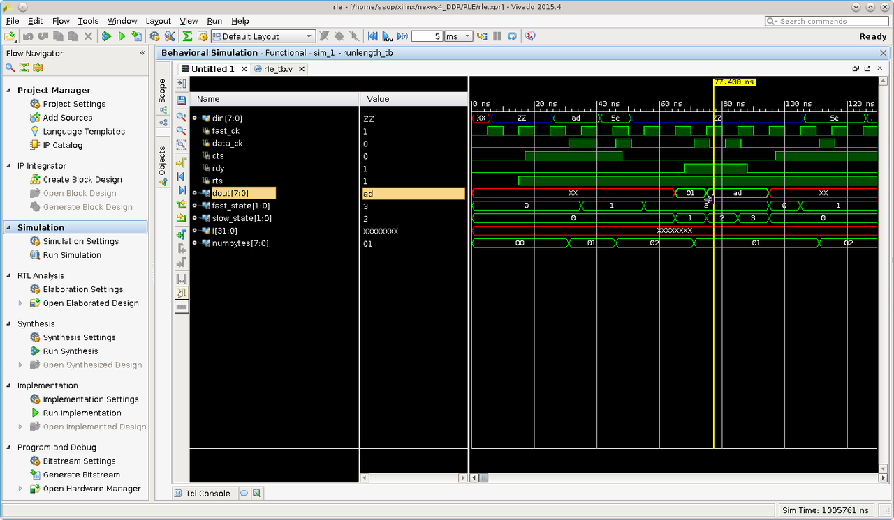
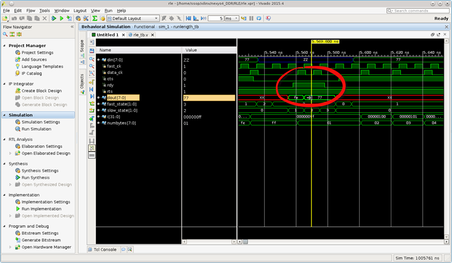

.. title: Run-length encoding with FPGA
.. slug: runlenth
.. date: 2016-03-26 18:40:58 UTC
.. tags: hardware
.. category: FPGA
.. link: 
.. description: 
.. type: text
.. $LastChangedDate: 2016-12-26 15:00:58 -0800 (Mon, 26 Dec 2016) $
.. $Rev: 93 $

Run-length encoding is one simple encoding, if not the simplest form of data compression. The more repetition in the
data stream the better it is. For example, if input data stream is 'A2.A2.C1.C2.B4.B4.B4.B4.B4.B4.B4.B4' the output 
would be '02.A2.01.C1.01.C2.08.B4'. If there are 258 bytes of B4, then output would be '...FF.B4.03.B4'.
In this experiment I simulated the flow of data stream and the encoding with verilog on the Nexys4DDR board, but first
I should specify the specification of the implementation.

.. TEASER_END

Design Specification
====================

*  Host shall assert RTS as a request to send.

*  In response to RTS, the target shall assert CTS if it is ready to process the incoming stream.

*  Host shall transmit on CTS response, place data to din, and strobe data with den as its clock. Host
   drives din and den signals. Host shall not drive din and den on deassertion of CTS.  

*  Host shall latch the byte count on the rising edge of drdy, and the byte value on its falling edge.

* At any time, host may terminate transmission by deasserting RTS. In response to the deassertion of RTS,
  target shall terminate its RLE process by returning all the remaining bytes count and byte value.  

Host refers to the source of input data stream while target is this simulated target circuit.  

Implementation
==============

Two state machines used in this implemenation. One state is on the main clock and the other is on the
data stream clock. The main clock is simulated at 100MHZ while the data clock is 180 degree out of phase
of the main clock. These two state machines represent the input state machine and the output state machine.

Tool and source files
=====================
- Vivado 2015.4
- source files: rle.v, rle_tb.v. No constraint file is required as it is only for simulation. Script file
  is also provided to set up the simulation (https://github.com/souktha/RLE).
  
        
Running simulation
------------------
        
- cd to source. 
- Start vivado.
- Select 'Tools->Run Tcl script'
- Select setup-rle.tcl
- On tcl console, 'create' to setup.
- 'Project Manager -> Run Simulation -> Run Behavioral Simulation'.

Simulation result
=================

The following figures show the result of my simulation. Fig 1 is the response of non repeated stream of 
charater bytes.

.. code-block:: 

        wait(cts)@(posedge fast_ck) begin
            #1 din = 8'hAD;
            #5 data_ck = 1'b1;
            end
        wait(cts)@(posedge fast_ck) begin
        #5 data_ck = 1'b0;
            #1 din = 8'h5E;
            #5 data_ck = 1'b1;
            end

        Fig1: input ad.5e output 01.ad 

and the case where maximum bytes count per transaction is reached. In this case the host send 258 bytes, Fig2.

.. code-block:: 

        for (i = 0; i < 258; i = i+1 ) begin
            #5 data_ck = 1'b0;
            wait(cts) @(posedge fast_ck) begin
                 #1 din = 8'h77;
                #5 data_ck = 1'b1;
                end
            end

        Fig2: 258 bytes breaks out with 254 bytes

It should have been 255 byte sent instead of 254; however, the bytes count is not lost as show in Fig3 where the
remaining 4 bytes follow.

.. figure:: ../../images/hardware/case5.png

        Fig3: 4 bytes sent follow the 254 bytes earlier.

and the remaining process continue until host ceases transmission, Fig4.

.. figure:: ../../images/hardware/case7.png

Conclusion
==========

While this type of encoding can be implemented easily in software, but I can tell that it is much faster
doing it in hardware and it may not be complicated as I thought it would be. It probably takes the same
amount of coding. One thing for sure, I cannot do certain thing in one clock cycle in software, but I
can do so in hardware. To me, this is the added benefit.
