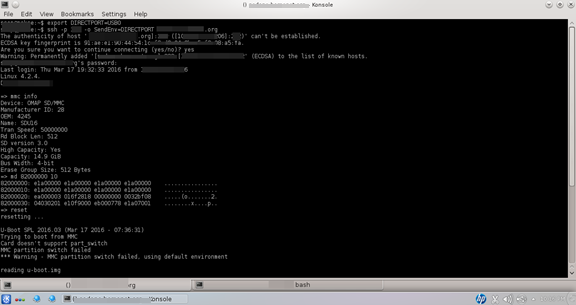

.. title: Redirect tty login from ssh to UART port
.. slug: tty2comport
.. date: 2016-03-18 03:15:48 UTC
.. tags: software
.. category: Linux
.. link: 
.. description: 
.. type: text
.. $Rev: 40 $
.. $HeadURL: file:///home/ssop/usb3/svn/repos/mysite/posts/software/tty2comport.rst $
.. $LastChangeDate$

Objective
=========

When I ssh from remote host machine to my local machine, say from outside place to host machine at home, I would 
like to directly access a device that is connected by serial console to my local machine, for example, a beaglebone black
board that is connected to my home PC serial console ttyUSB0. I implemented a simple console server for this purpose.

.. TEASER_END

Scenario
========
Outside remote host (ssh client)-------> local home machine(ssh server) ----ttyUSBx/ttySx------ beagleboneblack.

I want to do that without the need to call up a terminal access application such as minicom. While the application
of this type is very versatile, I some time have to fiddle with the settings. If I know exactly what my setting
is, for example, connect as 115200n8, I could just to go straight with this simple application, tty2comport.

How it works
============

Normally when I ssh from remote place, the ssh server will go through login process to authorize the access to my
local machine as set by user and password. Once logged in, I open up minicom and goes about accessing the 
connected device. Now with this, I just ssh in to the local machine, once connected, it goes directly to
the serial console port where I can go about accessing the attached device. No need for me to open up minicom
application. This happens because every I login, the shell profile will be launched. In my case it is bash
shell. 'ssh' deals only with secured transmission of data between two hosts between my chosen shell; therefore,
once ssh session is established,  bash will launch this application if it detects the passing parameter. The 
application then open up the ttyUSB0 and exchange data with STDIN_FILENO which is shell. Data transmitted during
my session between the two hosts remain secured by ssh.
It is tranparent for the entire session. Once I want to quit, I hit 'esc q', then logout from ssh session.
The program is not complicate and use only Unix standard library and does not require any library package outside
of what is readily available to Unix [1]_. Only one source file with less than 300 lines of code to do this !
http://github.com/souktha/tty2comport

Setup
======

Local host
----------

This is the home PC. For my use, I need to make sure to have the following settings:

1) "AcceptEnv DIRECTPORT" is added to /etc/ssh/sshd_config. Restart sshd as needed provided I just enable this
feature. This is where my home PC with beaglebone black connected to its ttyUSB0. I may need to restart sshd
service for the new feature to take effect.

2) Having this environment ready to be picked up in by login profile. For my case it is ".bash_profile", so I
edit to add

.. code-block:: bash
        
        case $DIRECTPORT in
                "USB0") /usr/bin/tty2comport $DIRECTPORT;;
        esac

I could add more option such as "S0" for ttyS0. This time I use ttyUSB0 for my serial console connection. Once
the ssh session is established, the DIRECTPORT enviroment will be passed to the bash profile. With this information, 
the tty2comport is launched.

Remote host
-----------

On the remote host, I need to make sure I have the DIRECTPORT environment variable set. If not yet set, I
would do,

.. code-block:: bash
        
        $set DIRECTPORT=USB0

Once this is set, I can do ssh to my remote 
        

Connecting via ssh
------------------

After the above settings is done, I should be able to connect,

.. code-block:: bash

        $ssh -o SendEnv=DIRECTPORT myusername@myhost 

        Accessing ttyUSB0 connected device (bblk's u-boot shell)

Citations
---------

.. [1] Advanced Programming in the UNIX Environment, W. Richard Stevens, 1992, Addison Wesley.

